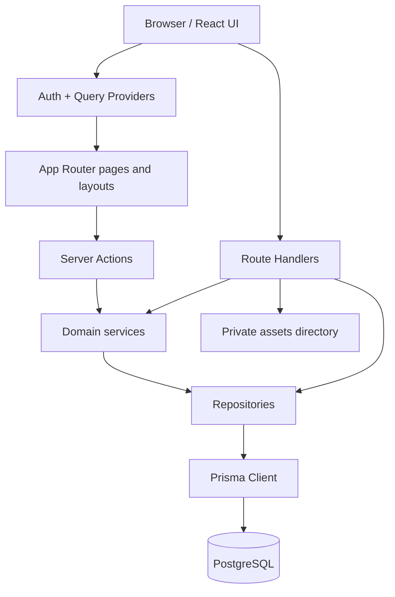

# Architecture

## Overview

CTF Silk Road is a single Next.js App Router application with colocated frontend routes, React components, Server Actions, Route Handlers, domain services, repositories, and Prisma data access. The repository is not a monorepo: the `modules/` directory is the primary architectural boundary.

## Key boundaries

| Boundary | Implementation | Responsibility |
|---|---|---|
| Routing/UI | `app/`, `components/`, `providers/` | Route composition, protected layouts, rendering, user interactions. |
| Server boundary | `modules/*/actions`, `app/api/**/route.ts` | Authentication, authorization, input validation, response shaping. |
| Domain logic | `modules/*/services` | Gameplay, event, session, admin, scoring, and orchestration rules. |
| Persistence | `modules/*/repositories`, `lib/prisma.ts` | Prisma queries and write shapes. |
| Data contracts | `modules/*/types`, `modules/*/utils/*.mapper.ts` | DTOs returned to client code. |
| Validation | `modules/*/validations`, `config/env.ts` | Zod validation for request payloads and runtime configuration. |
| Infrastructure | `docker-compose.yml`, `prisma/`, `scripts/` | Local database, migrations, generated client, seed/reset workflows. |

## Architecture documents

- [System overview](system-overview.md)
- [Application architecture](application-architecture.md)
- [Data flow](data-flow.md)
- [Security architecture](security-architecture.md)
- [Architectural decisions](decisions.md)
