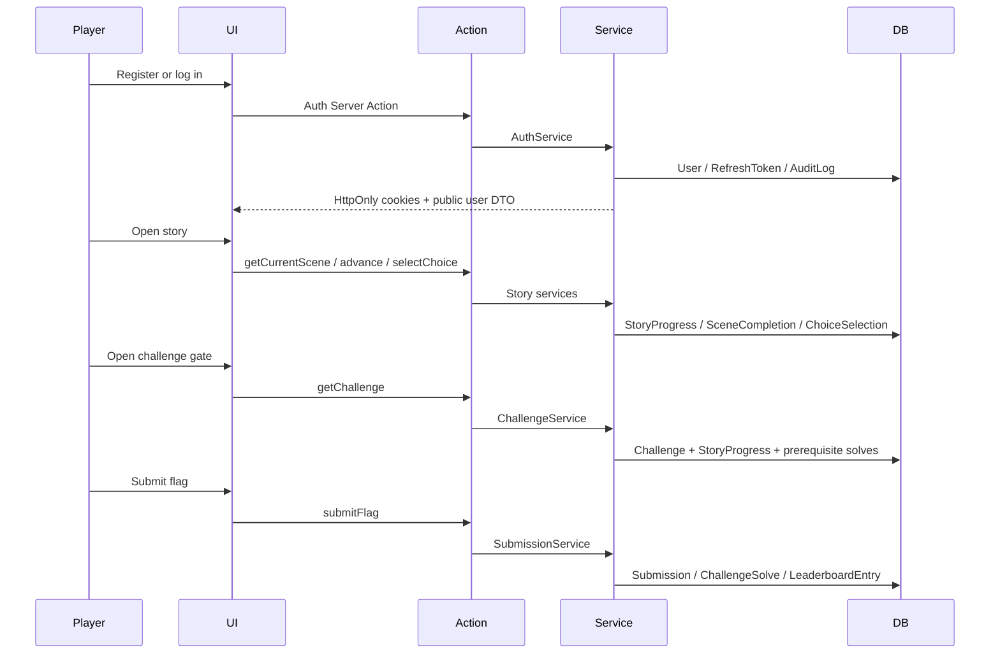

# Data Flow

## Player flow

## Event gate flow

Event access is derived from the singleton `Event` row and its `EventControl` row. Services that can affect gameplay or competitive fairness call `eventService.getEventAccess()` and fail closed when the event is not accessible, paused, not started, or ended.

## Challenge access flow

Challenge access is not based on a client-provided chapter, slug, or scene. The server reads the player's `StoryProgress.currentSceneId`, loads that scene, requires the scene to be a published `CHALLENGE_GATE`, verifies that `scene.challengeId` equals the requested challenge, and checks challenge prerequisites against `ChallengeSolve` rows.

## Scoring flow

Correct submissions create a `Submission` row and a `ChallengeSolve` row in one transaction. The composite primary key on `ChallengeSolve(userId, challengeId)` prevents duplicate solves. The same transaction updates `LeaderboardEntry` via an atomic SQL upsert. Hint purchases can decrement `LeaderboardEntry.totalXp` when the hint has a positive cost.

## Admin flow

Admin pages call admin Server Actions that require super-admin capabilities. Event controls mutate `EventControl`; player management mutates `User` status/password state and refresh tokens; leaderboard controls mutate `Event.leaderboardFrozenAt`; announcements and audit pages read/write their own modules.
