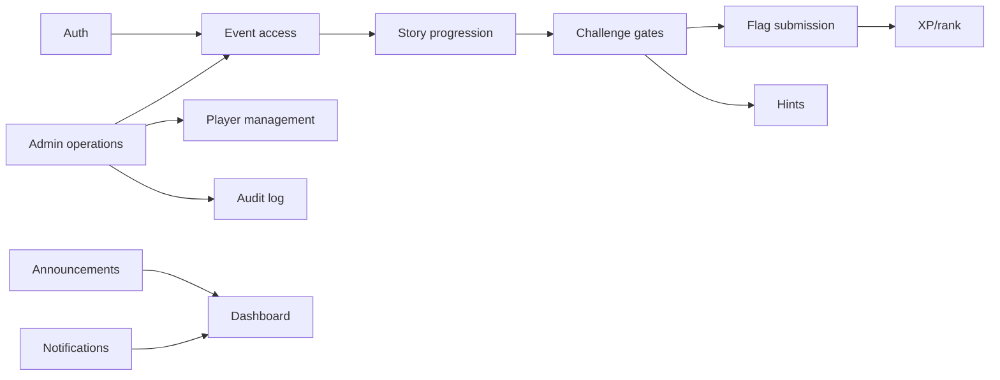

# System Overview

## What

The system is a live-event CTF platform built as a single full-stack Next.js 16 application. It combines a story engine, challenge gate enforcement, flag submission, scoring, leaderboard presentation, event operations, and administrative controls.

## Why

The project optimizes for live event correctness. A player should only see and attempt the challenge that their server-side story state currently allows. Competitive actions must be durable, auditable where appropriate, and resistant to client-side tampering.

## How

The browser renders route-level pages from `app/` and feature components from `components/`. Client hooks in `modules/*/hooks` call Server Actions from `modules/*/actions`. Actions authenticate with JWT cookies, authorize through the permission system, validate Zod payloads, and delegate business logic to services. Services compose repositories and other services. Repositories are the only layer that should encode Prisma query details.

## Runtime characteristics

- PostgreSQL is required for all durable state.
- Prisma Client is generated to `app/generated/prisma`.
- Most mutations are Server Actions, not REST endpoints.
- The only implemented HTTP API Route is the protected challenge attachment download route.
- There is no Redis/cache service in the current deployment; rate limiting is database-backed.
- Story content reads use an in-memory cache helper for selected published content.
