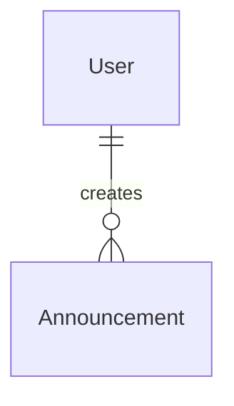

# Announcements Module

## 1. Overview

The announcements module manages event-wide messages created by admins and surfaced to players, including dashboard previews.

## 2. Responsibilities

- Create announcements with title, message, and priority.
- Update announcement content and priority.
- Archive announcements instead of deleting them through the exposed workflow.
- Provide paginated announcement lists and detail reads.
- Map announcement records to DTOs and record mutation audit events.

## 3. Non-Responsibilities

- Does not send push notifications, email, or websocket messages.
- Does not target announcements to specific users/teams.
- Does not own dashboard layout; dashboard only consumes announcement previews.

## 4. Features

Implemented: create, update, archive, list, detail, priority, published/archived status, admin access checks, dashboard preview consumption.

## 5. Architecture

```text
Admin announcement components / dashboard preview
 ↓
modules/announcement/hooks
 ↓
modules/announcement/actions
 ↓
AnnouncementService
 ↓
AnnouncementRepository
 ↓
Announcement table
```

## 6. Data Flow

Admin actions validate payloads and require announcement-management permission before service calls. Mutations persist announcement changes and record audit events. Dashboard reads a small page of announcements and degrades to `null` if announcement retrieval fails.

## 7. API / Interfaces

Server Actions: `createAnnouncement`, `updateAnnouncement`, `archiveAnnouncement`, `getAnnouncement`, `getAnnouncements`.

## 8. Data Model



`Announcement` stores title, message, priority, status, creator, and timestamps.

## 9. State Management

Announcement hooks use TanStack Query list/detail keys and mutation invalidation. Admin dialog state is component-local.

## 10. Security

Create/update/archive are admin-only. Player-facing dashboard data should only expose published, player-safe announcement fields.

## 11. Error Handling

Validation errors are returned for malformed inputs. Missing announcements return not found. Already-archived mutations should be treated as conflicts by the service.

## 12. Performance

List queries are paginated and indexed by status/created time. There is no push delivery or external cache.

## 13. Testing

No tests found. Add tests for admin authorization, archive behavior, pagination, dashboard degradation, and audit event recording.

## 14. Dependencies

Depends on Auth authorization, Audit, Dashboard, and Prisma.

## 15. Extension Points

Scheduling, targeting, and notification fan-out should be added explicitly rather than implied by the current announcement model.

## 16. Known Limitations

No scheduling, targeting, push delivery, markdown sanitizer policy, or expiry field was found.

## 17. Future Improvements

Add scheduled publishing, audience targeting, read receipts, and optional notification generation.

## Related documentation
- [Module map](../README.md)
- [Architecture](../../architecture/README.md)
- [Security](../../security/README.md)
