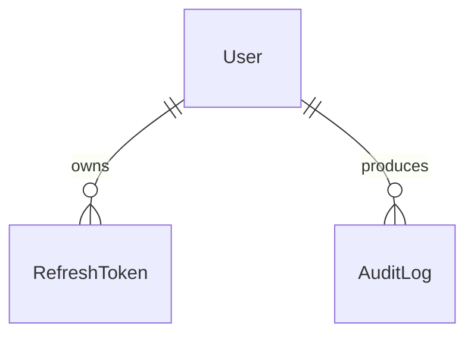

# Authentication Module

## 1. Overview

The authentication module owns identity, session establishment, token refresh, logout, password hashing, and permission checks. It is the gateway for protected Server Actions and protected UI routes.

## 2. Responsibilities

- Register users when event registration is open.
- Authenticate email/password credentials.
- Hash and verify passwords using Argon2id.
- Issue JWT access tokens and persisted refresh tokens.
- Rotate/revoke refresh tokens.
- Store auth cookies through the cookie service.
- Expose `requireAuth`, `requireRole`, and `requirePermission` helpers.
- Record auth-related audit events where implemented.

## 3. Non-Responsibilities

- It does not manage story progress, scoring, challenges, or event content.
- It does not query fresh user status on every JWT verification; callers needing current status must do an explicit database read.
- It does not implement OAuth, email verification delivery, or password reset self-service flows.

## 4. Features

Implemented: registration, login, logout, refresh session, session lookup, brute-force lockout fields, dummy verification for unknown login emails, banned-user login rejection, refresh-token reuse handling, HttpOnly cookie issuance, role-to-permission mapping.

Partially implemented: `emailVerified` fields exist, but no email verification workflow was found.

## 5. Architecture

```text
Auth UI / provider
 ↓
modules/auth/hooks
 ↓
modules/auth/actions
 ↓
authorization helpers + AuthService
 ↓
UserRepository / RefreshTokenRepository
 ↓
Prisma User / RefreshToken / AuditLog
```

## 6. Data Flow

Registration checks event access first, verifies email/username uniqueness, hashes the password, creates `User`, records audit, and returns a public user DTO. Login loads by email, handles lock/banned state, verifies the password, resets failed attempts, updates last login, creates a refresh token, records audit, then writes access/refresh cookies after the transaction succeeds.

## 7. API / Interfaces

Server Actions: `register`, `login`, `logout`, `refreshSession`, and `getSession`. Authorization helpers: `requireAuth()`, `requireRole([...])`, `requirePermission(permission)`. Cookie names and TTLs are centralized in auth constants.

## 8. Data Model



`User` stores identity, `passwordHash`, `role`, `status`, failed login counters, and timestamps. `RefreshToken` stores only token hashes, replacement linkage, expiry, revocation, user agent, and IP.

## 9. State Management

Client session state is exposed through auth provider/components and TanStack Query hooks. Server truth remains the access token cookie plus refresh-token table.

## 10. Security

Passwords are never stored raw. Refresh tokens are stored hashed. Access token verification fails closed. Permission checks are capability-based. Known limitation: JWT role/status can remain stale until token refresh or re-login because `requireAuth()` intentionally does not hit the database.

## 11. Error Handling

Invalid credentials are intentionally generic. Locked accounts return a retry time. Duplicate email/username races are handled via Prisma `P2002`. Expired/malformed access tokens map to invalid-session errors.

## 12. Performance

JWT verification avoids database reads. Argon2 work happens outside critical database transactions where possible. Login and submission paths are rate-limited through database buckets.

## 13. Testing

No auth-specific automated tests were found. Test priority should include registration races, login lockout, refresh rotation/reuse, cookie flags, and permission mapping.

## 14. Dependencies

Depends on Event for registration gating, Audit for auth logs, Notification for security messages, Prisma for users/tokens, and rate-limit utilities for pressure points.

## 15. Extension Points

Add new roles by updating the `Role` enum and `ROLE_PERMISSIONS`. Add OAuth or email verification as separate flows that still issue the same internal tokens. Keep token hashing and cookie handling centralized.

## 16. Known Limitations

No team membership, OAuth, MFA, email verification flow, or end-user password reset flow is currently implemented.

## 17. Future Improvements

Add MFA, verification emails, session management UI, refresh-token device inventory, and integration tests for auth security invariants.


## Related documentation
- [Documentation index](../../README.md)
- [Architecture](../../architecture/README.md)
- [Security](../../security/README.md)
- [Development](../../development/README.md)
