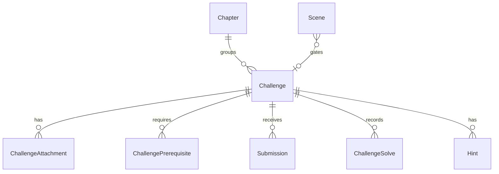

# Challenges Module

## 1. Overview

The challenge module owns challenge metadata, player-safe challenge DTOs, server-side access checks, flag hash verification helpers, and protected attachment lookup. It is the boundary between story progression and competitive submissions.

## 2. Responsibilities

- Read challenge catalog and individual challenges.
- Enforce player access through `ChallengeAccessService`.
- Store difficulty, XP reward, chapter/display order, prerequisites, attachments, and flag hashes.
- Serve player-safe challenge DTOs that do not expose flags.
- Provide flag comparison helpers.
- Protect private challenge attachments through a Route Handler.

## 3. Non-Responsibilities

- Does not record submissions or award XP; submission/leaderboard own that.
- Does not decide the current story scene; story progress owns that.
- Does not author or mutate challenge content in the current UI.

## 4. Features

Implemented: challenge reads, slug/id lookup, chapter lookup, prerequisites, attachments, hashed flags, player access gating, generic not-found on denial.

## 5. Architecture

```text
Challenge page / ChallengeGate
 ↓
challenge hooks/actions or attachment Route Handler
 ↓
ChallengeService / ChallengeAccessService / FlagService
 ↓
ChallengeRepository + StoryProgressRepository + StoryContentRepository + SubmissionRepository
 ↓
Challenge / Chapter / Scene / ChallengePrerequisite / ChallengeAttachment / ChallengeSolve
```

## 6. Data Flow

For player challenge access, the service loads event access, challenge prerequisites, and story progress. It then verifies the player's current scene is a published challenge gate pointing at the requested challenge and checks prerequisite solves. Unauthorized and nonexistent challenges are both returned as not found.

## 7. API / Interfaces

Server Actions: `getChallenges`, `getChallenge`. HTTP: `GET /api/challenges/[challengeId]/attachments/[attachmentId]` returns binary attachment data only after authentication and challenge authorization. Attachment responses use private no-store cache headers.

## 8. Data Model



Flags are represented only as server-side `flagHash` values. Documentation must use `<FLAG_REDACTED>` for any example flag.

## 9. State Management

Client challenge hooks use TanStack Query keys in `challenge.keys.ts`. Challenge access itself is not cached as an authority; services re-evaluate it for reads, hints, submissions, and attachments.

## 10. Security

Direct URL/API probing is mitigated by server-side access derivation from story state. Attachment file paths are allowlisted asset keys resolved under the private `assets/` root with containment checks. Raw flags and submitted incorrect flags are not returned to clients.

## 11. Error Handling

Lookup misses and access denials collapse to not found. Malformed flag hashes are logged as server errors during comparison. Attachment failures return generic 404.

## 12. Performance

Access evaluation uses two parallel read batches and skips prerequisite solve lookup when no prerequisites exist. Attachments are read from disk per request and are not shared-cacheable.

## 13. Testing

No tests found. Highest-value tests: direct-post bypass denial, prerequisite enforcement, current-scene mismatch, attachment path containment, and DTO redaction.

## 14. Dependencies

Depends on Event, Story, Submissions for solve lookup, Hints, Leaderboard through submission side effects.

## 15. Extension Points

Add challenge CMS only by preserving DTO redaction and server-side access checks. Additional unlock models should integrate through `ChallengeAccessService` rather than UI-only conditions.

## 16. Known Limitations

No implemented admin challenge CMS despite audit enum values. No team-based challenge access. No public category search endpoint was found.

## 17. Future Improvements

Admin challenge management, challenge analytics, attachment streaming/range support, and richer challenge categories.

## Related documentation
- [Module map](../README.md)
- [Architecture](../../architecture/README.md)
- [Security](../../security/README.md)
