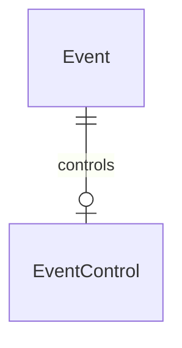

# Events Module

## 1. Overview

The event module owns the singleton competition window and derived gameplay access state. Admin event-control operations own pause/resume and registration enable/disable.

## 2. Responsibilities

- Load the singleton `Event` row.
- Load `EventControl` for operational overrides.
- Derive access state, registration eligibility, and countdowns.
- Gate gameplay and registration in dependent modules.

## 3. Non-Responsibilities

- Does not own challenge content or story progression.
- Does not own leaderboard ranking, only the freeze timestamp stored on `Event`.
- Does not implement multiple concurrent events.

## 4. Features

Implemented: singleton event, start/end times, leaderboard freeze timestamp, event control mode (`NORMAL`/`PAUSED`), registration toggle, countdown calculation, admin pause/resume/toggle registration.

## 5. Architecture

```text
Dashboard / auth / story / challenge / submission services
 ↓
EventService
 ↓
EventRepository + EventControlRepository
 ↓
Event + EventControl tables
```

## 6. Data Flow

`getEventAccess()` loads `Event` and `EventControl`, then derives booleans such as `hasStarted`, `hasEnded`, `canAccessGame`, `canRegister`, and `isPaused`. Gameplay writes and challenge access call this fresh rather than caching long-lived access state.

## 7. API / Interfaces

No standalone public event Server Action was found. Event data is surfaced through dashboard composition and admin event-control actions: `getEventControl`, `pauseEvent`, `resumeEvent`, `enableRegistration`, `disableRegistration`.

## 8. Data Model



`Event.singleton` enforces one active event row. `EventControl` is one-to-one by `eventId` and stores operational pause/registration state.

## 9. State Management

Dashboard and admin hooks cache event-control and dashboard DTOs through TanStack Query. Services re-read event state for critical gates.

## 10. Security

Gameplay access is enforced server-side. Event-control mutations require admin access and use conditional updates for atomic transitions.

## 11. Error Handling

Missing singleton `Event` or `EventControl` fails closed with not-found errors. Redundant pause/resume operations return conflicts; registration toggles are idempotent/no-op when already in requested state.

## 12. Performance

The event is a singleton; reads are cheap. Dashboard uses `getEventSummary()` to avoid repeated event/control loads.

## 13. Testing

No tests found. Add tests for boundary times, pause precedence, registration toggles, and missing seed behavior.

## 14. Dependencies

Auth registration, story navigation, challenge access, submission, dashboard, and leaderboard freeze all depend on event state.

## 15. Extension Points

Supporting multiple events would require replacing singleton assumptions throughout services, seeds, and route/query parameters.

## 16. Known Limitations

Single event only. No scheduled operational state changes or event CMS UI beyond current controls.

## 17. Future Improvements

Add event health checks, event templates, multi-event support, and explicit event status dashboard for operators.


## Related documentation
- [Documentation index](../../README.md)
- [Architecture](../../architecture/README.md)
- [Security](../../security/README.md)
- [Development](../../development/README.md)
