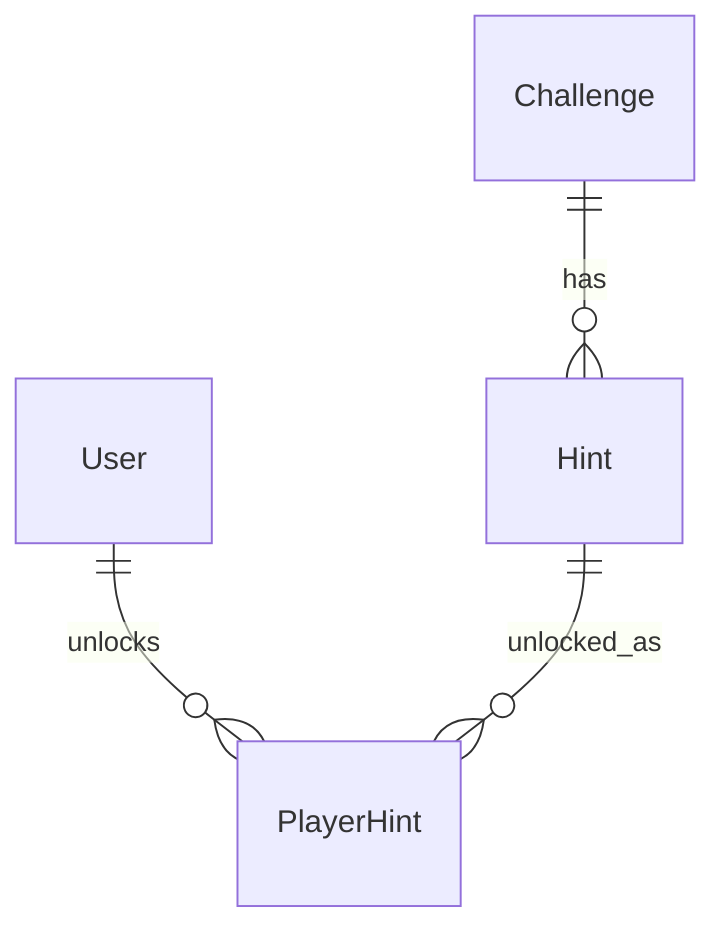

# Hints Module

## 1. Overview

The hints module exposes progressive assistance for the player's currently accessible challenge and records hint unlocks with optional XP cost.

## 2. Responsibilities

- List published hints for a challenge from a player's perspective.
- Enforce challenge access before showing or unlocking hints.
- Enforce sequential hint unlock order.
- Check current XP affordability.
- Create `PlayerHint` records and deduct XP for paid hints.
- Return DTOs that distinguish locked/unlocked/eligible states.

## 3. Non-Responsibilities

- Does not author hint content through a UI.
- Does not validate flags or solve challenges.
- Does not create audit events for hint unlocks; `PlayerHint` is the typed record.

## 4. Features

Implemented: challenge-scoped hint listing, level ordering, free/paid hint costs, affordability checks, duplicate unlock handling, XP deduction transaction.

## 5. Architecture

```text
Challenge hints UI
 ↓
modules/hint/hooks
 ↓
getChallengeHints / unlockHint actions
 ↓
HintService
 ↓
HintRepository + ChallengeAccessService + LeaderboardRepository
 ↓
Hint / PlayerHint / LeaderboardEntry
```

## 6. Data Flow

Reads first verify challenge access, then fetch published hints and current XP to compute eligibility. Unlocks verify the target hint, re-check challenge access, confirm previous-level unlock state and affordability, then create `PlayerHint` and decrement XP in one transaction for paid hints.

## 7. API / Interfaces

Server Actions: `getChallengeHints`, `unlockHint`.

## 8. Data Model



`Hint` has a unique `(challengeId, level)`. `PlayerHint` has a composite `(userId, hintId)` primary key.

## 9. State Management

Hint hooks use TanStack Query and mutation invalidation. Unlock state is persisted in `PlayerHint`, not local storage.

## 10. Security

Hints are answer-adjacent and must never be accessible by direct ID alone. The service re-derives challenge access through the same access service used by challenge/submission flows.

## 11. Error Handling

Missing or inaccessible hints/challenges return not found or generic errors. Already-unlocked and out-of-order hints return conflicts. Concurrent duplicate unlocks are resolved by the composite key.

## 12. Performance

Reads batch hint state and XP rank lookup. Paid unlocks use one transaction for hint creation and XP deduction.

## 13. Testing

No tests found. Add tests for access denial, level order, affordability races, duplicate unlocks, and free hints for users with zero XP.

## 14. Dependencies

Depends on ChallengeAccess, Leaderboard, Prisma, and challenge content.

## 15. Extension Points

Additional hint pricing rules should live in hint pricing/access utilities and preserve server-side affordability enforcement.

## 16. Known Limitations

No admin hint CMS found. Hint spending reduces XP balance but does not change solve count or historical solves.

## 17. Future Improvements

Add hint analytics, admin authoring, per-event pricing policies, and audit/telemetry for suspicious hint scraping.

## Related documentation
- [Module map](../README.md)
- [Architecture](../../architecture/README.md)
- [Security](../../security/README.md)
