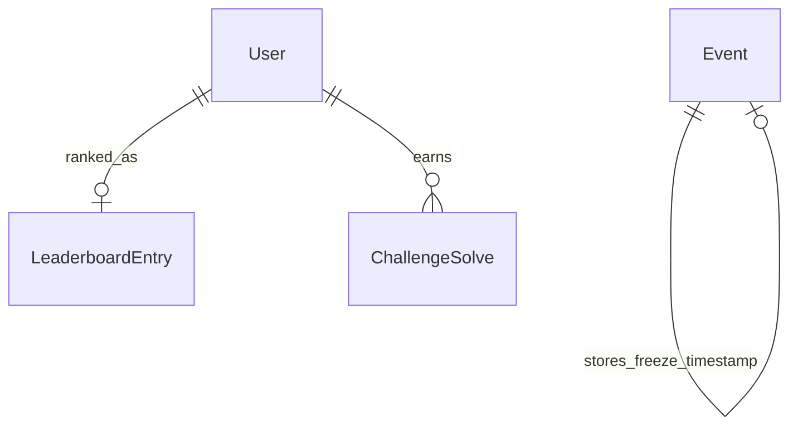

# Leaderboard Module

## 1. Overview

The leaderboard module owns ranking reads, rank lookup, live/frozen player views, admin live views, and freeze/unfreeze operations.

## 2. Responsibilities

- Present paginated live leaderboard entries.
- Present frozen player leaderboard when `Event.leaderboardFrozenAt` is set.
- Compute user rank with raw SQL window functions.
- Provide admin live leaderboard independent of freeze state.
- Freeze/unfreeze leaderboard and audit those actions.
- Provide repository writes used by submission/hint flows.

## 3. Non-Responsibilities

- Does not validate flags or create solves.
- Does not own event lifecycle beyond reading/updating freeze timestamp.
- Does not maintain a materialized frozen snapshot.

## 4. Features

Implemented: live ranking, frozen ranking, user rank, admin leaderboard, freeze/unfreeze, atomic solve upsert, XP decrement for hint spend.

## 5. Architecture

```text
Leaderboard UI / admin leaderboard UI
 ↓
leaderboard hooks/actions
 ↓
LeaderboardService
 ↓
LeaderboardRepository + EventService/EventRepository
 ↓
LeaderboardEntry / ChallengeSolve / Event
```

## 6. Data Flow

First solves update `LeaderboardEntry` through `upsertForSolve`. Player leaderboard reads use `LeaderboardEntry` while live. When frozen, player reads aggregate `ChallengeSolve` rows at or before the freeze timestamp. Admin reads always use live `LeaderboardEntry` rows.

## 7. API / Interfaces

Server Actions: `getLeaderboard`, `getMyRank`, `getUserRank`, `getAdminLeaderboard`, `freezeLeaderboard`, `unfreezeLeaderboard`. Player reads require leaderboard permissions; freeze operations require admin access.

## 8. Data Model



Ranking order is total XP descending, solved challenge count descending, then earliest last solve ascending.

## 9. State Management

Hooks use TanStack Query. Ranking is read on demand; no real-time push layer was found.

## 10. Security

Players only receive public user summary fields. Admin leaderboard includes email. Freeze/unfreeze require authorization and record audit events.

## 11. Error Handling

Freezing before event start or freezing/unfreezing in an invalid state returns conflict errors.

## 12. Performance

Live reads use indexed `leaderboard_entries`. Frozen reads use raw aggregation over `challenge_solves`; this is acceptable for modest event sizes but should be monitored at scale.

## 13. Testing

No tests found. Add tests for tie-breaking, frozen cutoff correctness, duplicate solve updates, and XP decrement race behavior.

## 14. Dependencies

Depends on Event, Audit, Submission, Hint, User.

## 15. Extension Points

Team rankings should be added as a distinct model/query path rather than overloading user leaderboard rows.

## 16. Known Limitations

No materialized snapshots, no real-time updates, no team rankings, no public export endpoint found.

## 17. Future Improvements

Snapshot frozen leaderboard for large events, add WebSocket/SSE refresh, add exports, and add historical rank deltas.

## Related documentation
- [Module map](../README.md)
- [Architecture](../../architecture/README.md)
- [Security](../../security/README.md)
