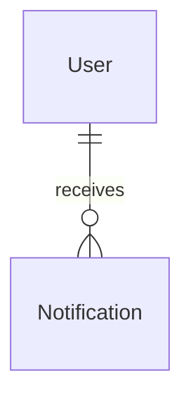

# Notifications Module

## 1. Overview

The notification module stores in-app, per-user messages with read state. It is used by dashboard previews and selected system/admin flows such as ban notifications.

## 2. Responsibilities

- Create notifications for a target user.
- List a user's notifications with pagination.
- Fetch notification detail.
- Count unread notifications.
- Mark one notification or all notifications as read.
- Map notification records to player-safe DTOs.

## 3. Non-Responsibilities

- Does not deliver email, SMS, push, or websocket notifications.
- Does not replace announcements; announcements are event-wide content.
- Does not own admin moderation decisions that may create notifications.

## 4. Features

Implemented: create, list, detail, unread count, mark-one-read, mark-all-read, resource metadata, priority/type fields.

## 5. Architecture

```text
Dashboard notification components / system service call
 ↓
modules/notification/hooks or direct service call
 ↓
Notification actions/service
 ↓
NotificationRepository
 ↓
Notification table
```

## 6. Data Flow

Dashboard builds a minimal actor for the current user, retrieves unread count and recent notifications, and degrades if notification reads fail. Write actions validate notification IDs or payloads and scope reads/writes to the authenticated actor or authorized creator.

## 7. API / Interfaces

Server Actions: `createNotification`, `getNotifications`, `getNotification`, `getUnreadNotificationCount`, `markNotificationAsRead`, `markAllNotificationsAsRead`.

## 8. Data Model



Notifications store type, priority, title, message, optional resource type/id, `readAt`, and `createdAt`.

## 9. State Management

Notification hooks use TanStack Query list/detail/unread keys. Read mutations should invalidate unread count and relevant lists.

## 10. Security

User reads and read-state mutations must remain self-scoped. Notification creation is permission-guarded for admin/system use cases.

## 11. Error Handling

Missing notification IDs return not found. Unauthorized cross-user access should be rejected without exposing another user's notification data.

## 12. Performance

Indexes support `(userId, readAt)` and `(userId, createdAt desc)`. Lists should remain paginated.

## 13. Testing

No tests found. Add tests for self-scoping, unread counts, mark-all behavior, and dashboard degradation.

## 14. Dependencies

Depends on Auth/AuditActor semantics, Dashboard, Admin player management, and Prisma.

## 15. Extension Points

Add delivery channels behind explicit services so in-app persistence remains independent of email/push concerns.

## 16. Known Limitations

No external delivery, broadcast fan-out, retention policy, or notification preferences were found.

## 17. Future Improvements

Add notification preferences, realtime updates, retention/cleanup, and resource-specific deep links.

## Related documentation
- [Module map](../README.md)
- [Architecture](../../architecture/README.md)
- [Security](../../security/README.md)
