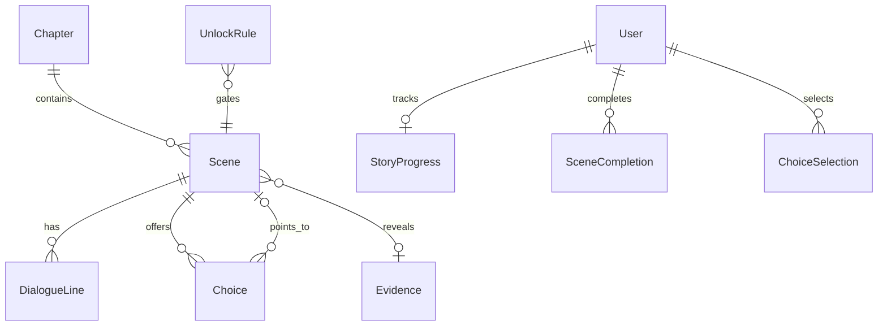

# Story / Investigation Module

## 1. Overview

The story module is the investigation engine. It manages chapters, scenes, dialogue, choices, evidence, unlock rules, progress, replay, and restart behavior without exposing narrative secrets in this documentation.

## 2. Responsibilities

- Bootstrap and maintain `StoryProgress` for each player.
- Render current-scene data through DTOs.
- Advance linear scenes and process branching choices.
- Record completed scenes and selected choices.
- Evaluate unlock rules for chapters, scenes, and evidence.
- Expose chapter map, evidence board, evidence detail, replay, history, and restart flows.
- Integrate challenge gates into story progression.

## 3. Non-Responsibilities

- Does not validate flags or award XP.
- Does not expose hidden evidence content until unlock rules pass.
- Does not modify protected story source documents from documentation work.

## 4. Features

Implemented: chapter map, current scene, scene advance, choice selection, challenge gates, evidence unlocks, evidence board/detail, scene replay for completed scenes, story restart, story history, in-memory cache for published chapter/story content reads.

## 5. Architecture

```text
Story pages/components
 ↓
story hooks/actions
 ↓
StoryService + StoryNavigationService + SceneService + EvidenceService + UnlockService
 ↓
StoryContentRepository + StoryProgressRepository + UnlockRuleRepository
 ↓
Chapter / Scene / DialogueLine / Choice / Evidence / UnlockRule / StoryProgress
```

## 6. Data Flow

A player opening the story invokes current-scene logic, which can create initial progress. Advancing a scene records completion and moves to the next unlocked scene. Choice scenes record the chosen option and move to its destination. Challenge-gate scenes are advanced after the corresponding correct solve. Evidence reads evaluate unlock rules and completion state server-side.

## 7. API / Interfaces

Server Actions: `getCurrentScene`, `advanceScene`, `selectChoice`, `getChapterMap`, `getEvidenceBoard`, `getEvidence`, `getStoryHistory`, `getStoryProgress`, `replayScene`, and `restartStory`. Write paths are event-access gated; read-only map/replay behavior is intentionally less restrictive where fairness is not affected.

## 8. Data Model



`UnlockRule.referenceId` is intentionally untyped and interpreted by service logic according to condition type.

## 9. State Management

Story UI uses client hooks for current scene, progress, chapter map, history, replay, and evidence. Animation/audio/typewriter behavior is component-local; authoritative progression is persisted server-side.

## 10. Security

Evidence and challenge-gate access are server-authoritative. Do not expose branch destinations, locked evidence content, answers, or actual clue text in public docs. Restart requires explicit confirmation.

## 11. Error Handling

Not-started progress is a valid dashboard state. Missing current scene/content is logged as integrity failure. Invalid scene/choice IDs fail validation or service relationship checks.

## 12. Performance

Published chapter/content reads are cached in memory for short TTLs where implemented. History/title lookup batches scene IDs to avoid N+1 lookups.

## 13. Testing

No tests found. Add tests for initial bootstrap, choice validity, challenge-gate advancement, evidence unlocks, replay authorization, and restart side effects.

## 14. Dependencies

Depends on Event for write gates, Challenge/Submissions for challenge gates, Audit for restart event, and assets registries for visual content.

## 15. Extension Points

Add new scene types by updating schema enum, mappers, services, and UI renderers together. Keep narrative content in seed/story files and protect it from incidental docs edits.

## 16. Known Limitations

No story CMS UI found. Story restart does not reset submissions/solves/leaderboard by design. Some future media fields exist but are not fully used.

## 17. Future Improvements

Authoring tools, validation for story graphs, migration-safe unlock-rule references, richer replay/history metadata, and story engine tests.

## Related documentation
- [Module map](../README.md)
- [Architecture](../../architecture/README.md)
- [Security](../../security/README.md)
