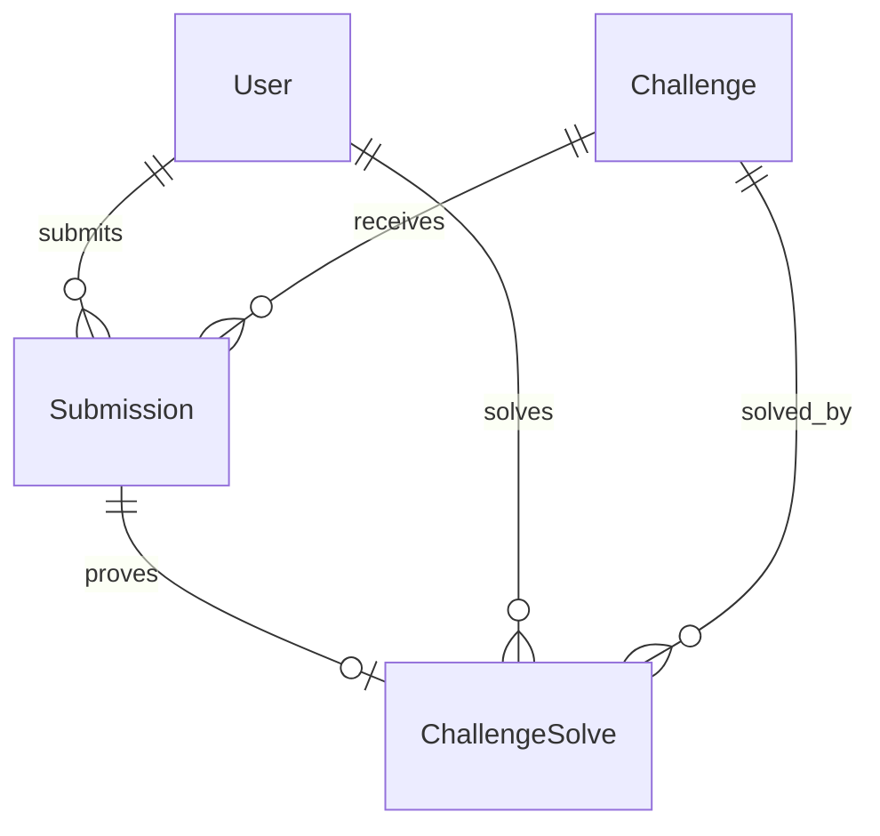

# Submissions Module

## 1. Overview

The submissions module owns flag-attempt writes, correct-solve creation, duplicate-solve behavior, event/challenge access enforcement on submit, and the player's own submission history.

## 2. Responsibilities

- Validate submitted challenge IDs and flag format.
- Enforce event-live and challenge-access gates before verification.
- Rate-limit flag submissions.
- Store every attempt as a `Submission`.
- Create `ChallengeSolve` for first correct solves only.
- Update `LeaderboardEntry` atomically with first solves.
- Advance story after correct challenge-gate solves when applicable.

## 3. Non-Responsibilities

- Does not author challenge flags or metadata.
- Does not compute leaderboard page queries.
- Does not expose other users' submissions.

## 4. Features

Implemented: global and per-user submission rate limits, normalized `CTF{...}` style validation, correct/incorrect attempt recording, duplicate correct submission response with no extra XP, own-history read.

## 5. Architecture

```text
Flag form
 ↓
useSubmitFlag → submitFlag Server Action
 ↓
SubmissionService
 ↓
EventService + ChallengeAccessService + ChallengeRepository + FlagService
 ↓
SubmissionRepository + LeaderboardRepository + StoryNavigationService
 ↓
Submission / ChallengeSolve / LeaderboardEntry / StoryProgress
```

## 6. Data Flow

The service checks event access, per-user rate limit, and challenge authorization before loading flag verification data. It compares the submitted flag with the stored hash, writes the attempt, creates a solve when correct, updates leaderboard in the same transaction, and then attempts story advancement in a separate story transaction.

## 7. API / Interfaces

Server Actions: `submitFlag(challengeId, flag)` and `getMySubmissions()`. `submitFlag` requires `SUBMIT_FLAG`; `getMySubmissions` requires authentication and is self-scoped.

## 8. Data Model



Incorrect submissions store no reusable flag hash. Correct submissions store `submittedFlagHash`; raw `submittedFlag` should not be populated or exposed.

## 9. State Management

The flag form uses mutation hooks and invalidates challenge/submission/leaderboard/story state as needed by hook implementation.

## 10. Security

Client-side validation is not authoritative. The server validates format, rate limits, re-derives challenge authorization, compares against server-side hash, and uses database uniqueness to prevent score manipulation.

## 11. Error Handling

Too many requests return rate-limit errors. Invalid payloads return validation errors. Inaccessible challenges return not found. Duplicate correct solves return success semantics with `alreadySolved` and zero XP.

## 12. Performance

Rate limit checks happen before expensive flag comparison. Flag verification occurs outside the transaction; database writes are grouped for consistency.

## 13. Testing

No tests found. Add tests for duplicate solve race, incorrect attempts, rate limits, inaccessible challenge submissions, and leaderboard update atomicity.

## 14. Dependencies

Depends on Auth, Event, Challenge, Story, Leaderboard, Prisma, and rate limiting.

## 15. Extension Points

Add penalty/bonus scoring in this module because it owns the attempt lifecycle. Any future team scoring must update this flow and leaderboard atomically.

## 16. Known Limitations

No team submissions. No visible admin submission export action found despite audit enum placeholders. Story advancement is best-effort after the scoring transaction rather than part of the same transaction.

## 17. Future Improvements

Submission analytics, team mode, richer anti-bruteforce telemetry, and admin review/export tooling.

## Related documentation
- [Module map](../README.md)
- [Architecture](../../architecture/README.md)
- [Security](../../security/README.md)
