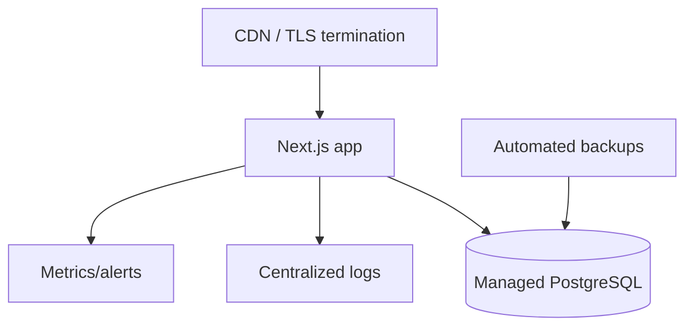

# Deployment

## Current deployment support

The repository includes application build/start scripts, Prisma migrations, seed scripts, and a local Docker Compose PostgreSQL service. It does not include production hosting manifests, CI/CD pipelines, reverse proxy configuration, or backup automation.

## Build process

```bash
npm ci
npm run build
npm run start
```

`npm run build` executes `prisma generate && next build`.

## Database

Production requires PostgreSQL. Apply migrations before serving traffic:

```bash
npx prisma migrate deploy
```

Seed scripts contain game/event content and should be run deliberately for the target environment. Do not run destructive reset scripts in production.

## Required production environment

Set all variables listed in [Environment](../development/environment.md). Secrets must come from the hosting platform's secret manager.

## Recommended production architecture



Recommended additions: managed PostgreSQL with backups/PITR, structured log aggregation, uptime checks, error tracking, migration runbook, rollback plan, and secret rotation process.
