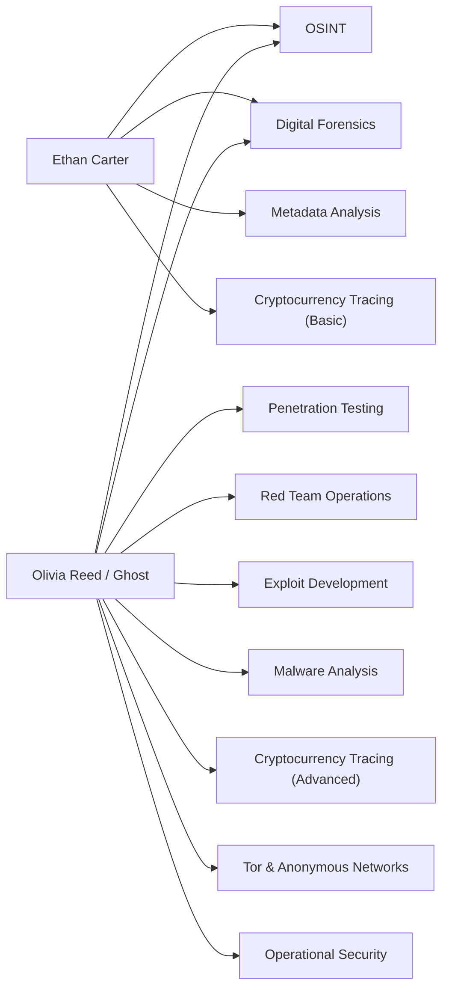

# Challenges — The Silk Road Investigation

> **Document type:** Production / Game Design Reference
> **Location:** `docs/story/CHALLENGES.md`
> **Audience:** Challenge creators, developers, narrative writers, QA
> **Status:** 🟡 Living document — Prologue and Chapter 1 challenges are now populated below; later chapters remain framework-only until their story content is provided.

This document defines the challenge category framework derived from established character skill sets and narrative motifs, plus the populated tracker for every challenge confirmed so far.

---

## Table of Contents

- [Design Philosophy](#design-philosophy)
- [Flag Format Convention](#flag-format-convention)
- [Challenge Categories](#challenge-categories)
- [Challenge Tracker](#challenge-tracker)
- [Challenge Detail — Prologue](#challenge-detail--prologue)
- [Challenge Detail — Chapter 1](#challenge-detail--chapter-1)
- [Character-to-Category Mapping](#character-to-category-mapping)
- [Difficulty Guidelines](#difficulty-guidelines)
- [Open Conflicts / TODO](#open-conflicts--todo)
- [Changelog](#changelog)

---

## Design Philosophy

> [!IMPORTANT]
> Ethan Carter is explicitly **not** an elite hacker — the source material states he "doesn't magically hack into systems in seconds" and instead relies on publicly available information and investigative reasoning. Challenges built around Ethan's perspective should be biased toward **OSINT, forensics, metadata, and deduction**, not exploit-style hacking.
>
> Olivia Reed ("Ghost"), by contrast, is an elite offensive-security specialist. Any challenge attributed to her — even anonymously — can justifiably use more advanced red-team/exploit tradecraft. In Chapter 1, Ghost's involvement is limited to *leaving* a clue (CH-003); she does not perform on-page exploit work yet, so CH-003 stays at Introductory tier despite her skill set — the player is finding her clue, not replicating her tradecraft.

Every challenge should be traceable to:
1. A **story beat** (see [`STORY.md`](./STORY.md), [`PROLOGUE.md`](./PROLOGUE.md), [`CHAPTER_01.md`](./CHAPTER_01.md), and [`TIMELINE.md`](./TIMELINE.md))
2. A **piece of evidence** (see [`EVIDENCE.md`](./EVIDENCE.md))
3. A **character skill set** (see [`CHARACTERS.md`](./CHARACTERS.md))

---

## Flag Format Convention

> [!NOTE]
> No flag format existed anywhere in prior documentation. The convention below is an **assumption**, not a confirmed decision — verify against `submission/utils/normalize-flag.ts` and `hash-flag.ts` before implementation, since flag normalization logic already exists in the codebase and should govern the final format, not this document.

Proposed format: `SR{snake_case_answer}` — e.g. `SR{c2_relay_confirmed}`.

- Case-insensitive at submission time (confirm this matches `normalize-flag.ts`'s actual behavior — do not assume).
- No spaces; multi-word answers use underscores.
- Prologue-tier flags should read as a short confirmation phrase, not a literal extracted string, to avoid the flag itself spoiling the puzzle when seen out of context (e.g. leaderboard exports, hint previews).

---

## Challenge Categories

Derived directly from the confirmed skill sets of Ethan Carter and Olivia Reed ("Ghost"):

| Category | Primary Skill Owner | Description |
|---|---|---|
| Digital Forensics | Ethan Carter, Ghost | Recovering and analyzing digital artifacts from files, devices, or systems. |
| OSINT | Ethan Carter, Ghost | Investigation using publicly available information. |
| Metadata Analysis | Ethan Carter, Ghost | Extracting hidden information from file metadata. |
| Cryptocurrency Tracing | Ethan Carter (basic), Ghost (advanced) | Following anonymous transactions through blockchain analysis. |
| Penetration Testing | Ghost | Identifying and demonstrating system vulnerabilities. |
| Red Team Operations | Ghost | Simulated adversarial operations. |
| Exploit Development | Ghost | Building proof-of-concept exploits. |
| Malware Analysis | Ghost | Reverse-engineering malicious code samples. |
| Tor & Anonymous Networks | Ghost | Investigating dark-web / hidden-service infrastructure. |
| Operational Security (OPSEC) | Ghost | Puzzles about maintaining or breaking anonymity. |

---

## Challenge Tracker

| Challenge ID | Title | Category | Difficulty | Points | Related Character | Story Tie-In | Related Evidence | Flag Format | Status |
|---|---|---|---|---|---|---|---|---|---|
| CH-000 | The Pattern | OSINT, Metadata Analysis | Introductory | 50 | Ethan Carter | `PROLOGUE.md` Scene 5 | EVID-003 | `SR{...}` | 🧩 Planned |
| CH-001 | The First Digital Clue | Digital Forensics, Metadata Analysis | Introductory | 100 | Ethan Carter, Noah Carter | `CHAPTER_01.md` Task 1 | EVID-007 | `SR{...}` | 🧩 Planned |
| CH-002 | The Hidden Web | OSINT, Tor & Anonymous Networks | Introductory | 100 | Ethan Carter | `CHAPTER_01.md` Task 2 | EVID-008 | `SR{...}` | 🧩 Planned |
| CH-003 | The Ghost | Digital Forensics, Metadata Analysis | Introductory–Intermediate | 150 | Ethan Carter, Olivia Reed / Ghost | `CHAPTER_01.md` Task 3 | EVID-009 | `SR{...}` | 🧩 Planned |
| CH-004 | Understanding the Dark Web | OSINT, Tor & Anonymous Networks | Introductory | 100 | Ethan Carter | `CHAPTER_01.md` Task 4 | EVID-010 | `SR{...}` | 🧩 Planned |
| CH-005 | The Pattern in the Data | OSINT, Metadata Analysis, Cryptocurrency Tracing (Basic) | Intermediate | 200 | Ethan Carter | `CHAPTER_01.md` Task 5 | EVID-003, EVID-011 | `SR{...}` | 🧩 Planned |

> Numbering note: `CH-000` is used for the Prologue tutorial challenge so Chapter 1 keeps the `CH-001`–`CH-005` numbering already referenced throughout `TIMELINE.md`, `CHARACTERS.md`, and `CHAPTER_01.md`. Confirm this numbering scheme against the actual `Challenge` Prisma model / seed scripts before implementation — if `seed-challenges.ts` already assumes 1-indexed IDs, renumber here instead of in the seed data.

---

## Challenge Detail — Prologue

### CH-000 — "The Pattern"

| Field | Detail |
|---|---|
| Story tie-in | `PROLOGUE.md` Scene 5 — the hard boundary between cinematic prologue and interactive gameplay; the first checkpoint/save state. |
| Player framing | The player is handed a small set of overdose case reports (abstracted, not yet Noah-specific) and must cross-match wallets and metadata directly — no narration of the result. |
| Mechanic | Compare structured fields (dates, supplier codes, transaction hashes) across ~5–8 case files to find the recurring anomaly. |
| Success state | UI/diegetic state change: "PATTERN DETECTED" (per `PROLOGUE.md`), which should fire regardless of flag submission timing if the platform supports partial-progress UI states — confirm with `dashboard`/`story` module owners. |
| Evidence produced | EVID-003 (Cross-Case Overdose Report Pattern). |
| Difficulty rationale | Per `CHALLENGES.md` → Difficulty Guidelines, Introductory tier "should mirror Ethan's own first discoveries — simple pattern-recognition across provided case files." This is the literal template case for that guideline. |
| Design constraint | No `.onion`, no cryptography, no exploit content — this challenge exists to teach the *comparison* verb the rest of the game reuses, not to introduce new tradecraft. |

---

## Challenge Detail — Chapter 1

### CH-001 — "The First Digital Clue"

| Field | Detail |
|---|---|
| Story tie-in | `CHAPTER_01.md` Task 1. |
| Player framing | Ethan has Noah's returned digital effects (phone export, laptop backup, cloud archive). The player browses a file listing and must identify the one file whose metadata doesn't belong — a deleted-but-recoverable file with a modified timestamp and a domain-suffix reference that doesn't match any clearnet TLD. |
| Mechanic | File/metadata inspection (e.g. EXIF, filesystem timestamps, a recovered-file listing) — Digital Forensics + Metadata Analysis, consistent with Ethan's confirmed skill set. |
| Evidence produced | EVID-007 (Noah's Recovered Cloud Backup). |
| Design constraint | The flag should be recoverable entirely from data already provided in the effects archive — no external lookups required at this tier. |

### CH-002 — "The Hidden Web"

| Field | Detail |
|---|---|
| Story tie-in | `CHAPTER_01.md` Task 2. |
| Player framing | Working from the domain-suffix lead in CH-001, the player reviews a small set of network/browser artifacts and must correctly identify which entries are `.onion` traffic versus ordinary clearnet noise, then reconstruct the (deliberately partial) address. |
| Mechanic | OSINT + basic Tor/anonymous-network literacy — recognizing `.onion` structure, distinguishing it from decoys. |
| Evidence produced | EVID-008 (Onion Service Reference) — intentionally incomplete; the flag confirms *recognition*, not a working address, per `CHAPTER_01.md`'s design intent of leaving the player at "the edge of what's currently knowable." |
| Design constraint | Do not use a real, resolvable-looking `.onion` string. Use an obviously fictional placeholder pattern reviewed by the technical team — see Open Conflicts below. |

### CH-003 — "The Ghost"

| Field | Detail |
|---|---|
| Story tie-in | `CHAPTER_01.md` Task 3 — Olivia Reed / Ghost's confirmed first in-story contact (`TIMELINE.md` #18). |
| Player framing | An anonymous, unsigned message arrives in Ethan's inbox. Its visible text ("You're looking in the right place. Wrong door.") gives no usable information on its own — the player must extract a hidden clue from the message itself (e.g. attachment metadata, or a simple encoding/steganographic layer) rather than take it at face value. |
| Mechanic | Digital Forensics / Metadata Analysis, kept at Introductory–Intermediate specifically *because* the player is finding Ghost's clue, not performing Ghost-tier tradecraft (see Design Philosophy note above). |
| Evidence produced | EVID-009 (Ghost's First Contact) — completes the partial address from EVID-008. |
| Design constraint | Ghost's in-fiction voice must stay terse and unexplained per `CHARACTERS.md` (no signature, no reassurance, no hint that she's a known quantity). The puzzle's difficulty should come from the extraction technique, not from cryptic narrative red herrings. |

### CH-004 — "Understanding the Dark Web"

| Field | Detail |
|---|---|
| Story tie-in | `CHAPTER_01.md` Task 4. |
| Player framing | Framed as Ethan's own research pass — the player works through a hidden-service descriptor and a simplified onion-routing diagram to correctly characterize the infrastructure Ghost's clue pointed at. |
| Mechanic | OSINT + Tor & Anonymous Networks, but at a conceptual/comprehension level (matching descriptor fields, correctly labeling a routing diagram) rather than live network interaction. |
| Evidence produced | EVID-010 (Dark Web Primer / Annotated Hidden-Service Descriptor). |
| Design constraint | Per the Phase 1 brief, this is explicitly the "important learning point" task — content should be technically accurate (real Tor/hidden-service concepts) rather than stylized "hacker movie" material, per `CHALLENGES.md`'s category definitions. |

### CH-005 — "The Pattern in the Data"

| Field | Detail |
|---|---|
| Story tie-in | `CHAPTER_01.md` Task 5. |
| Player framing | Ethan obtains a larger, multi-city case record set. The player cross-references it against everything gathered so far (EVID-003, EVID-007–EVID-010) to surface a shared low-value cryptocurrency touchpoint linking Noah's case to at least two other victims. |
| Mechanic | OSINT + Metadata Analysis + basic Cryptocurrency Tracing — the first challenge in the game to require combining more than one evidence category, matching the Intermediate tier definition below. |
| Evidence produced | EVID-011 (Multi-City Case Comparison Set), building directly on EVID-003. |
| Design constraint | ⚠️ See Open Conflicts — this task's premise overlaps with `PROLOGUE.md` Scene 5 / CH-000 and needs narrative-lead confirmation on how the two are differentiated before final content is written. |

---

## Character-to-Category Mapping

---

## Difficulty Guidelines

| Tier | Suggested Story Placement | Notes |
|---|---|---|
| Introductory | Prologue / tutorial | Should mirror Ethan's own first discoveries — simple pattern-recognition across provided case files. |
| Intermediate | Early-to-mid game | Requires combining more than one evidence category (e.g., metadata + OSINT). |
| Advanced | Mid-to-late game | Justified narratively by Ghost's anonymous assistance or Ethan's growing experience. |
| Expert | Late game / optional | Reserved for content matching Ghost's elite-tier skill set (exploit development, malware analysis). |

> 🧩 **TODO** — Confirm scoring scale, hint policy, and platform (e.g., self-hosted CTFd instance vs. custom UI) once defined by the technical team. Point values in the Challenge Tracker above (50/100/100/150/100/200) are placeholders scaled relative to each other by difficulty tier, not a confirmed scoring policy.

---

## Open Conflicts / TODO

- ⚠️ **CH-000 vs. CH-005 narrative overlap.** `TIMELINE.md` #20 and `CHAPTER_01.md`'s Open Conflicts section both flag that Scene 5's pattern discovery and Task 5's pattern discovery cover very similar ground. This document's working resolution — Scene 5 finds *a* pattern exists in general; Task 5 confirms Noah is *personally* inside it — is a design assumption, not a confirmed decision. Do not build final content for CH-005 until the narrative lead signs off on this distinction.
- 🧩 Flag format (`SR{...}`) is an assumption — cross-check against `modules/submission/utils/normalize-flag.ts` before implementation.
- 🧩 Challenge numbering (`CH-000` for the Prologue tutorial) is a documentation convenience — confirm against however `scripts/seed-challenges.ts` currently indexes challenges before this becomes the source of truth other docs link against.
- 🧩 Points values are placeholders pending an actual scoring policy.
- 🧩 CH-002/CH-003's `.onion` placeholder string content still needs to be authored by someone who can guarantee it doesn't resemble a real, resolvable hidden-service address.
- 🧩 Hint policy (cost, unlock mechanism) is referenced by the `hint` module in the codebase but not yet defined at the design level for any of these five challenges.

---

## Changelog

| Date | Change |
|---|---|
| 🧩 TODO | Initial creation — framework only; no specific challenges defined yet. |
| 2026-08-15 | Populated `CH-000` (Prologue tutorial, `PROLOGUE.md` Scene 5) and `CH-001`–`CH-005` (Chapter 1, from `CHAPTER_01.md`). Added Flag Format Convention (assumption, needs verification against `normalize-flag.ts`), per-challenge detail sections, and Open Conflicts covering the CH-000/CH-005 narrative overlap, numbering, flag format, and points placeholders. |