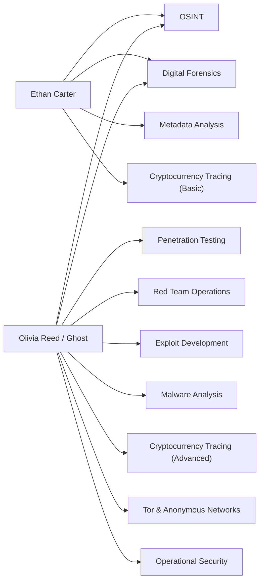

# Challenges — The Silk Road Investigation

> **Document type:** Production / Game Design Reference
> **Location:** `docs/story/CHALLENGES.md`
> **Audience:** Challenge creators, developers, narrative writers, QA
> **Status:** 🟡 Living document — no specific challenges have been finalized yet; this file defines the framework challenge creators should build within

This document defines the challenge category framework derived from established character skill sets and narrative motifs, plus the tracking template challenge creators should use as content is built.

---

## Table of Contents

- [Design Philosophy](#design-philosophy)
- [Challenge Categories](#challenge-categories)
- [Challenge Tracker Template](#challenge-tracker-template)
- [Character-to-Category Mapping](#character-to-category-mapping)
- [Difficulty Guidelines](#difficulty-guidelines)
- [Changelog](#changelog)

---

## Design Philosophy

> [!IMPORTANT]
> Ethan Carter is explicitly **not** an elite hacker — the source material states he "doesn't magically hack into systems in seconds" and instead relies on publicly available information and investigative reasoning. Challenges built around Ethan's perspective should be biased toward **OSINT, forensics, metadata, and deduction**, not exploit-style hacking.
>
> Olivia Reed ("Ghost"), by contrast, is an elite offensive-security specialist. Any challenge attributed to her — even anonymously — can justifiably use more advanced red-team/exploit tradecraft.

Every challenge should be traceable to:
1. A **story beat** (see [`STORY.md`](./STORY.md) and [`TIMELINE.md`](./TIMELINE.md))
2. A **piece of evidence** (see [`EVIDENCE.md`](./EVIDENCE.md))
3. A **character skill set** (see [`CHARACTERS.md`](./CHARACTERS.md))

---

## Challenge Categories

Derived directly from the confirmed skill sets of Ethan Carter and Olivia Reed ("Ghost"):

| Category | Primary Skill Owner | Description |
|---|---|---|
| Digital Forensics | Ethan Carter, Ghost | Recovering and analyzing digital artifacts from files, devices, or systems. |
| OSINT | Ethan Carter, Ghost | Investigation using publicly available information. |
| Metadata Analysis | Ethan Carter, Ghost | Extracting hidden information from file metadata. |
| Cryptocurrency Tracing | Ethan Carter (basic), Ghost (advanced) | Following anonymous transactions through blockchain analysis. |
| Penetration Testing | Ghost | Identifying and demonstrating system vulnerabilities. |
| Red Team Operations | Ghost | Simulated adversarial operations. |
| Exploit Development | Ghost | Building proof-of-concept exploits. |
| Malware Analysis | Ghost | Reverse-engineering malicious code samples. |
| Tor & Anonymous Networks | Ghost | Investigating dark-web / hidden-service infrastructure. |
| Operational Security (OPSEC) | Ghost | Puzzles about maintaining or breaking anonymity. |

> 🧩 **TODO** — No specific challenges have been defined yet. Populate the tracker below as challenges are designed.

---

## Challenge Tracker Template

| Challenge ID | Title | Category | Difficulty | Points | Related Character | Story Tie-In | Related Evidence | Flag Format | Status |
|---|---|---|---|---|---|---|---|---|---|
| CH-001 | 🧩 TODO | 🧩 TODO | 🧩 TODO | 🧩 TODO | 🧩 TODO | 🧩 TODO | 🧩 TODO | 🧩 TODO | 🧩 Planned |

**Field Guide**

- **Challenge ID** — Unique identifier, format `CH-0XX`, sequential.
- **Title** — In-fiction or thematic name (avoid generic titles like "Crypto 1").
- **Category** — One of the categories above.
- **Difficulty** — See [Difficulty Guidelines](#difficulty-guidelines).
- **Points** — Scoring value, set per project scoring policy.
- **Related Character** — Cross-reference [`CHARACTERS.md`](./CHARACTERS.md).
- **Story Tie-In** — Which story beat this challenge unlocks or reveals; cross-reference [`STORY.md`](./STORY.md) / [`TIMELINE.md`](./TIMELINE.md).
- **Related Evidence** — Cross-reference `Evidence ID` from [`EVIDENCE.md`](./EVIDENCE.md).
- **Flag Format** — The expected flag/answer format for the challenge.
- **Status** — Planned / In Progress / Implemented / QA / Live.

---

## Character-to-Category Mapping

---

## Difficulty Guidelines

| Tier | Suggested Story Placement | Notes |
|---|---|---|
| Introductory | Prologue / tutorial | Should mirror Ethan's own first discoveries — simple pattern-recognition across provided case files. |
| Intermediate | Early-to-mid game | Requires combining more than one evidence category (e.g., metadata + OSINT). |
| Advanced | Mid-to-late game | Justified narratively by Ghost's anonymous assistance or Ethan's growing experience. |
| Expert | Late game / optional | Reserved for content matching Ghost's elite-tier skill set (exploit development, malware analysis). |

> 🧩 **TODO** — Confirm scoring scale, hint policy, and platform (e.g., self-hosted CTFd instance vs. custom UI) once defined by the technical team.

---

## Changelog

| Date | Change |
|---|---|
| 🧩 TODO | Initial creation — framework only; no specific challenges defined yet. |