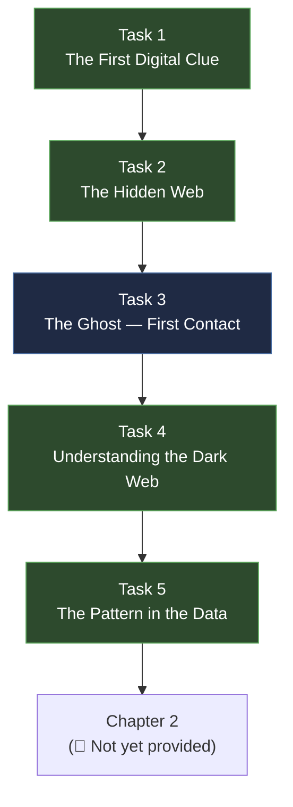

# Chapter 1 — "The First Clue" (Production Breakdown)

> **Document type:** Narrative Design Reference — Task-Level Production Breakdown
> **Location:** `docs/story/CHAPTER_01.md`
> **Audience:** Narrative writers, challenge creators, developers, UI/UX designers, QA
> **Status:** 🟡 Living document — first pass, derived from the Phase 1 Story Brief (PDF) and confirmed against `STORY.md`, `TIMELINE.md`, `CHARACTERS.md`, `EVIDENCE.md`
> **Depends on:** [`STORY.md`](./STORY.md), [`PROLOGUE.md`](./PROLOGUE.md), [`CHARACTERS.md`](./CHARACTERS.md), [`TIMELINE.md`](./TIMELINE.md), [`EVIDENCE.md`](./EVIDENCE.md), [`CHALLENGES.md`](./CHALLENGES.md)

---

## Table of Contents

- [Purpose & Scope](#purpose--scope)
- [Relationship to the Phase 1 Brief](#relationship-to-the-phase-1-brief)
- [Design Goals](#design-goals)
- [Task Breakdown](#task-breakdown)
- [Task Flow Diagram](#task-flow-diagram)
- [Cross-Reference Table](#cross-reference-table)
- [Open Conflicts / TODO](#open-conflicts--todo)
- [Changelog](#changelog)

---

## Purpose & Scope

This document is the shot-list equivalent of `PROLOGUE.md`, but for Chapter 1. Where the Phase 1 Story Brief (PDF) gives the five tasks in condensed prose, this file breaks each one into staging, revised dialogue, evidence output, and the exact hook into `CHALLENGES.md`.

> [!IMPORTANT]
> Unlike the Prologue, none of Chapter 1 is purely cinematic — every task in this chapter is gameplay-first. Staging notes here describe the framing *around* a challenge (what Ethan is doing, what Ghost's clue looks like in-fiction), not a cutscene replacing it.

---

## Relationship to the Phase 1 Brief

| | Phase 1 Story Brief (PDF) | CHAPTER_01.md (this document) |
|---|---|---|
| Purpose | Approved narrative outline for Chapter 1 | Task-by-task implementation breakdown |
| Format | Condensed prose, five named tasks | Per-task staging, dialogue, evidence, challenge hook |
| Editing policy | Preserve as source narrative intent | Living — updated as tasks are staged/built |

---

## Design Goals

1. **Continue the tutorial arc started in `PROLOGUE.md` Scene 5.** The player already knows how pattern-matching feels from the Prologue; Chapter 1 raises the stakes without changing the core verbs (compare, cross-reference, extract).
2. **Ghost's first contact must not explain itself.** Per `CHARACTERS.md`, Ghost "speaks only when necessary." Task 3 should read as unsettling, not friendly.
3. **The Dark Web / Tor material teaches, it doesn't lecture.** Task 4 is Ethan's (and the player's) crash course — deliver it through something Ethan is reading or annotating, not an expository cutscene.
4. **Every task ends with the player holding something new**, consistent with `EVIDENCE.md`'s framing of evidence as the mechanism of progression, not a reward screen.
5. **Preserve Ethan's skill ceiling.** Per `CHALLENGES.md`'s Design Philosophy, nothing in this chapter should require exploit-tier tradecraft — that's reserved for Ghost's off-page work, referenced but not player-performed here.

---

## Task Breakdown

### Task 1 — The First Digital Clue

| Field | Detail |
|---|---|
| Location | Ethan's desk, FBI bullpen (continuity with `PROLOGUE.md` Scene 4/5 environment) |
| Beat | Ethan requests and receives Noah's returned personal effects from evidence intake: phone, laptop backup export, and a cloud-storage archive pulled under next-of-kin authorization. |
| Player action | Examine the digital effects directly — file listing, timestamps, and a deleted-but-recoverable file are all present in the same evidence set. Nothing is narrated as "found"; the player opens it. |
| Key line (Ethan, internal) | *"Noah didn't talk to me about this. But his files will."* |
| Output | Evidence: `EVID-007` (Noah's Recovered Cloud Backup) — contains a single file with metadata pointing to a non-standard domain suffix. |
| Design intent | Mirrors `PROLOGUE.md` Scene 5's "don't narrate the discovery" principle — the clue is metadata the player has to notice, not a line of dialogue that states it. |
| Challenge hook | `CHALLENGES.md` → `CH-001` |

### Task 2 — The Hidden Web

| Field | Detail |
|---|---|
| Beat | Following the metadata trail from Task 1, Ethan pulls partial browser/network artifacts tied to the same account and finds repeated connections to a `.onion` address format he doesn't recognize. |
| Key line (Ethan, internal) | *"That's not a website address. Not one I know, anyway."* |
| Player action | Identify and correctly interpret the `.onion` artifact from a small set of network/browser logs — distinguishing it from ordinary clearnet traffic. |
| Output | Evidence: `EVID-008` (Onion Service Reference) — a partial `.onion` address, incomplete/obscured, insufficient on its own to visit. |
| Design intent | Deliberately leaves the address incomplete — Ethan (and the player) should feel the edge of what's currently knowable, not be handed a working link. Reinforces "he only knows something connects Noah's death to a hidden network" per the Phase 1 brief. |
| Challenge hook | `CHALLENGES.md` → `CH-002` |

### Task 3 — The Ghost

| Field | Detail |
|---|---|
| Beat | An unsolicited, anonymous message arrives in Ethan's work inbox — no sender name, routed through a relay that resists straightforward tracing. It is not a reply to anything Ethan sent. |
| Key line (message body, terse, unsigned) | *"You're looking in the right place. Wrong door."* |
| Player action | Extract a hidden clue embedded in the message itself (attachment metadata / steganographic or encoded content) rather than trusting the message text at face value — consistent with Ghost never simply stating what she knows. |
| Output | Evidence: `EVID-009` (Ghost's First Contact) — an anonymized message plus one recovered fragment (a corrected/completed version of the partial `.onion` reference from Task 2). |
| Design intent | Ghost should feel like she is *testing* Ethan as much as helping him. No signature, no explanation, no promise of more — per `CHARACTERS.md`'s design notes, she "never asks for trust, only presents facts." |
| Continuity | This is Ghost/Olivia Reed's confirmed first in-story appearance (`TIMELINE.md` #18). Do not reveal or hint at her identity here. |
| Challenge hook | `CHALLENGES.md` → `CH-003` |

### Task 4 — Understanding the Dark Web

| Field | Detail |
|---|---|
| Beat | Ethan pulls internal FBI training material and open-source references on Tor and hidden services to understand the environment Task 2–3 pointed him toward. Framed as Ethan's own homework, not a tutorial pop-up. |
| Key line (Ethan, internal) | *"If I don't understand how this works, I'll never see who's using it."* |
| Player action | Work through a short set of structured questions/artifacts (a hidden-service descriptor, a simplified onion-routing diagram) to correctly characterize what kind of infrastructure Ghost's clue is pointing at. |
| Output | Evidence: `EVID-010` (Dark Web Primer / Annotated Hidden-Service Descriptor) — Ethan's own annotated notes, now canon reference material he can act on. |
| Design intent | This is the one task that's explicitly educational per the Phase 1 brief ("important learning point for Ethan — and for the investigators following his trail"). Keep it grounded in real Tor/OSINT concepts, not technobabble, per `CHALLENGES.md`'s category definitions. |
| Challenge hook | `CHALLENGES.md` → `CH-004` |

### Task 5 — The Pattern in the Data

| Field | Detail |
|---|---|
| Beat | Ethan obtains a larger set of overdose case records — multiple cities, multiple suppliers — through channels adjacent to (but distinct from) the archive access his supervisor denied in `PROLOGUE.md` Scene 6. |
| Key line (Ethan, internal) | *"Noah wasn't the only one. He was one of many."* |
| Player action | Cross-reference the new case set against what Ethan already has (`EVID-003`, `EVID-007`–`EVID-010`) to surface a shared financial/technical signature across victims. |
| Output | Evidence: `EVID-011` (Multi-City Case Comparison Set) — a confirmed cross-case link (a shared, low-value cryptocurrency wallet touchpoint) tying Noah's supply chain to at least two other victims. |
| Design intent | This is the escalation of `PROLOGUE.md` Scene 5, not a repeat of it — Scene 5 found *that* a pattern existed among old reports in general; this task proves Noah is *personally* inside that pattern. See Open Conflicts below for the reconciliation this requires in `TIMELINE.md`. |
| Challenge hook | `CHALLENGES.md` → `CH-005` |

---

## Task Flow Diagram

---

## Cross-Reference Table

| Task | Phase 1 Brief Section | Evidence | Character(s) | Timeline # | Challenge ID |
|---|---|---|---|---|---|
| 1 | "The First Digital Clue" | EVID-007 | Ethan Carter, Noah Carter | #16 | CH-001 |
| 2 | "The Hidden Web" | EVID-008 | Ethan Carter | #17 | CH-002 |
| 3 | "The Ghost" | EVID-009 | Ethan Carter, Olivia Reed / Ghost | #18 | CH-003 |
| 4 | "Understanding the Dark Web" | EVID-010 | Ethan Carter | #19 | CH-004 |
| 5 | "The Pattern in the Data" | EVID-003, EVID-011 | Ethan Carter | #20 | CH-005 |

---

## Open Conflicts / TODO

- 🧩 **Scene 5 vs. Task 5 overlap** — `TIMELINE.md` #20 already flags that Task 5 closely mirrors `PROLOGUE.md` Scene 5. This document resolves it as: Scene 5 = pattern exists in general (tutorial-tier, abstract case files); Task 5 = Noah is confirmed inside that pattern (Chapter 1, uses Noah-specific data). Needs narrative-lead sign-off — do not treat as final until confirmed.
- 🧩 Ghost's message-relay method in Task 3 (email? dead drop? in-game inbox?) is not specified anywhere in canon. Placeholder: anonymized inbox message. Confirm before implementation.
- 🧩 The exact partial/complete `.onion` address content (Tasks 2–3) needs real placeholder values from the technical team — do not invent a real-looking `.onion` string without review (avoid accidental resemblance to real dark-web infrastructure).
- 🧩 Whether Ethan's supervisor or Brooks are aware of/reference Chapter 1's progress is undefined — `CHARACTERS.md` Brooks arc says he's "watching," but no Chapter 1 beat currently shows this. Flag for narrative lead: does Chapter 1 need a Brooks check-in beat, or does surveillance stay silent until Chapter 2+?

---

## Changelog

| Date | Change |
|---|---|
| 2026-08-15 | Initial creation from the Phase 1 Story Brief (PDF), cross-referenced against `STORY.md`, `TIMELINE.md` #16–20, `CHARACTERS.md`, and `EVIDENCE.md`. Introduced EVID-007–EVID-011 (logged in `EVIDENCE.md`). Flagged Scene 5 / Task 5 overlap for narrative-lead resolution; flagged undefined Ghost relay method and placeholder `.onion` values. |