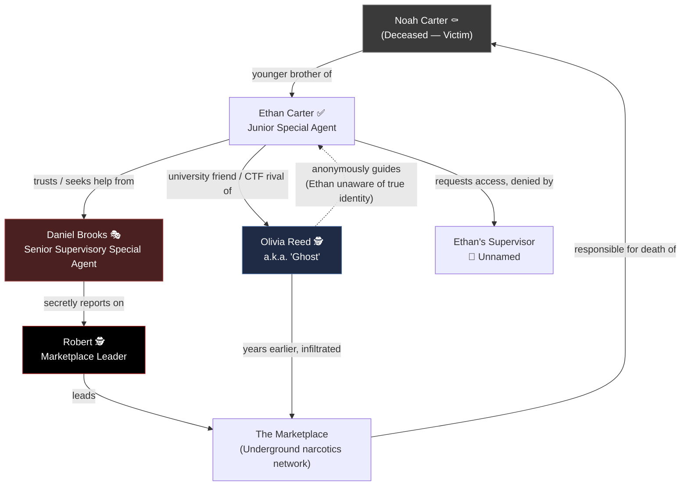

# Characters — The Silk Road Investigation

> **Document type:** Narrative Design Reference
> **Location:** `docs/story/CHARACTERS.md`
> **Audience:** Developers, narrative writers, game designers, UI/UX designers, challenge creators, artists, QA
> **Status:** 🟡 Living document — updated as new character material is provided

This document is the single source of truth for every character in *The Silk Road Investigation*. It is not a novel — it is a production reference. Every section is written to be scanned quickly by someone building a challenge, writing dialogue, or drawing concept art.

> [!NOTE]
> If a fact is not yet confirmed by the story source material, it is marked `TODO` rather than invented. Do not fill in `TODO` fields with guesses — flag them to the narrative lead instead.

---

## Table of Contents

- [Legend](#legend)
- [Cast Overview](#cast-overview)
- [Ethan Carter](#ethan-carter)
- [Daniel Brooks](#daniel-brooks)
- [Olivia Reed ("Ghost")](#olivia-reed-ghost)
- [Robert](#robert)
- [Noah Carter (Deceased)](#noah-carter-deceased)
- [Unnamed / Minor Characters](#unnamed--minor-characters)
- [Relationship Diagram](#relationship-diagram)
- [Changelog](#changelog)

---

## Legend

| Symbol | Meaning |
|---|---|
| ✅ | Alive / Active |
| ⚰️ | Deceased |
| 🎭 | Compromised / Living a double life |
| 🕵️ | Hidden identity / Unknown to other characters |
| 🧩 | TODO — awaiting narrative input |

---

## Cast Overview

| Character | Alias | Role | Affiliation | Status |
|---|---|---|---|---|
| [Ethan Carter](#ethan-carter) | — | Protagonist / Playable Investigator | FBI — Cyber Intelligence Support | ✅ Active |
| [Daniel Brooks](#daniel-brooks) | — | Mentor Figure / Hidden Antagonist | FBI — Cyber Crime & Organized Crime Task Force | 🎭 Compromised |
| [Olivia Reed](#olivia-reed-ghost) | Ghost | Hidden Ally / Anonymous Informant | Independent (Former Gray-Hat Hacker) | 🕵️ Hidden Identity |
| [Robert](#robert) | — | Primary Antagonist | Leader of the underground marketplace | 🧩 TODO |
| [Noah Carter](#noah-carter-deceased) | — | Inciting Incident / Victim | Civilian | ⚰️ Deceased |

---

## Ethan Carter

### Overview

Ethan Carter is the player's primary investigative avatar — a newly graduated FBI agent whose personal loss becomes the engine of the entire investigation. He is defined by quiet persistence rather than action-hero bravado: his superpower is that he refuses to accept "coincidence."

### Role in Story

Protagonist and playable investigator. The player experiences the mystery of the underground marketplace through Ethan's eyes, following the trail his brother's death set in motion.

### Basic Information

| Field | Value |
|---|---|
| Age | 26 |
| Occupation | Special Agent, FBI |
| Rank | Junior Special Agent |
| Division | Cyber Intelligence Support |
| Security Clearance | Level 1 |
| Cases Solved | 0 (at story start) |
| Reputation | 12/100 (at story start) |
| Organization | Federal Bureau of Investigation (FBI) |
| Status | ✅ Active |
| First Appearance | Prologue — "The Beginning" |

### Appearance

> 🧩 **TODO** — No physical appearance details have been provided yet. Do not invent hair color, build, or clothing until confirmed by the narrative lead.

### Personality

Ethan is calm under pressure, naturally curious, highly analytical, persistent, empathetic, humble, and slightly introverted.

- **Calm Under Pressure** — Even in stressful situations, Ethan doesn't panic. He pauses, observes, and thinks before acting. *"Everyone else sees chaos. Ethan sees patterns."*
- **Naturally Curious** — He can't ignore unanswered questions. If something doesn't make sense, he'll stay awake all night trying to figure it out. He refuses to accept "coincidence" as an explanation.
- **Highly Analytical** — Instead of asking "Who did this?" he asks "What evidence did they leave behind?" He notices tiny details others overlook.
- **Persistent** — When everyone tells him to stop investigating, he keeps going — not because he's reckless, but because he believes the truth always leaves a trail.
- **Empathetic** — Noah's death changed him. Every victim reminds him of his brother. He investigates not for recognition, but to stop more families from suffering.
- **Humble** — He's the newest agent in the office and knows he isn't the smartest person in the room. He asks questions, listens, and learns — this makes him relatable.
- **Slightly Introverted** — He prefers evidence over conversation. Small talk isn't his strength. Computers make more sense to him than people.

### Core Traits

- Calm under pressure
- Naturally curious
- Highly analytical
- Persistent
- Empathetic
- Humble
- Slightly introverted

### Strengths

- Refuses to accept coincidence — always looks for the underlying pattern
- Notices small details others miss
- Extremely persistent once on a lead
- Genuine empathy for victims drives sustained motivation
- Approachable and humble, which makes other characters willing to help him

### Weaknesses

- **Emotional** — When Noah is mentioned, his judgment can become clouded.
- **Inexperienced** — He often makes procedural mistakes because he's still learning. Senior agents remind him: *"You're thinking like an investigator... not like an FBI agent."*
- **Trusting** — At first, he trusts everyone inside the Bureau. That changes as the story unfolds.
- **Obsessive** — Once he starts following a lead, he can't let it go, even when it costs him sleep, relationships, or his career.

### Skills

Because he's in Cyber Intelligence, Ethan is skilled at:

- Digital Forensics
- Open Source Intelligence (OSINT)
- Metadata Analysis
- Cryptocurrency tracing (basic level)
- Internet investigations
- Pattern recognition
- Research

> [!IMPORTANT]
> Ethan is **not** an elite hacker and does not "hack into systems in seconds." His method is always publicly available information plus investigative reasoning. Challenge and dialogue writers should preserve this — puzzles built around Ethan should reward OSINT and deduction, not instant exploit-style hacking.

### Habits

- Always carries a notebook instead of relying only on his phone.
- Drinks too much black coffee during late-night investigations.
- Keeps Noah's old keychain in his pocket as a reminder of why he's fighting.
- Writes timelines and evidence on a whiteboard, connecting clues with strings or markers.
- Reads every report from beginning to end, including the footnotes.

### Motivation

Ethan's brother, Noah Carter, died of an overdose caused by contaminated synthetic narcotics sold through an underground marketplace. Ethan made a promise standing beside his brother's body: he would find the people responsible and destroy the organization that profits from destroying lives, no matter the cost.

### Internal Conflict

Ethan must balance his personal grief and obsession with the discipline required of a federal investigator. His emotional stake in the case is simultaneously his greatest motivator and his greatest liability — it clouds his judgment and makes him a target for manipulation by those who understand what happened to Noah.

### Philosophy

> "People lie. Evidence doesn't."

### Signature Quote

> "People lie. Evidence doesn't."

### Relationships

| Character | Relationship |
|---|---|
| Noah Carter | Younger brother; his death is the reason Ethan joined this investigation. |
| Daniel Brooks | Senior agent Ethan admires and trusts early on; Brooks discourages his investigation while secretly reporting on him. |
| Olivia Reed / Ghost | University friend and CTF rival, whom Ethan remembers as brilliant and competitive. He does not know that his old friend Olivia and the anonymous hacker "Ghost" guiding his investigation are the same person. |
| Robert | Unaware of each other directly at story start; Robert is monitoring Ethan's progress from the shadows. |

### Story Arc (Spoilers)

Ethan begins as an unremarkable rookie processing digital evidence. Reviewing old overdose reports in his own time, he detects a pattern across cities, suppliers, and investigations that others have dismissed as coincidence — anonymous cryptocurrency transactions, encrypted communications, disappearing evidence, vanished witnesses, and cases quietly closed without explanation. His request for access to archived intelligence files is denied by his supervisor. He then turns to Senior Agent Daniel Brooks, whom he trusts and admires, only to be told there is no organization, no marketplace, no evidence — that he has been "chasing ghosts." Unknown to Ethan, Brooks immediately reports his progress to Robert, the man behind the marketplace, marking Ethan as someone to watch.

> 🧩 **TODO** — Further chapters/acts of Ethan's arc have not yet been provided.

### Gameplay Relevance

**How this character affects:**

- **Challenges** — Ethan is the player-character lens; challenges he encounters should be OSINT/forensics/reasoning-based, consistent with his stated skill set, not instant "hollywood hacking."
- **Evidence** — Player-collected evidence is filtered through Ethan's whiteboard/notebook habit — consider a UI element themed around this (corkboard, red string, notebook).
- **Dialogue** — Ethan should read as humble and inquisitive, not commanding; he asks questions more than he makes declarations, especially with senior characters.
- **Choices** — Ethan's obsessive/trusting flaws are strong hooks for dilemma-style choices (e.g., pursuing a lead against orders; trusting an anonymous informant).
- **Unlocks** — 🧩 TODO — specific unlock gating tied to Ethan's arc has not yet been defined.

### Design Notes

> Guidelines for future writers:
> - Keep Ethan's dialogue understated. He is not a quip-driven action hero — his strength is patience and pattern recognition.
> - Any puzzle "solved" by Ethan alone should be solvable through legitimate OSINT/forensic method, never a shortcut that contradicts his established skill ceiling.
> - Preserve the "People lie. Evidence doesn't." philosophy as a recurring narrative device (loading screens, chapter title cards, etc.).

### Image Generation Prompt

```
A realistic portrait of a 26-year-old male FBI special agent, early career, junior investigator archetype. Neutral, approachable, slightly tired but alert facial expression — the look of someone who has been up late reading case files. Short, practical, low-maintenance hairstyle. Attentive, focused eyes that suggest quiet intelligence rather than aggression. Wearing a slightly rumpled, inexpensive dark suit with a loosened tie and a plain FBI-issue lanyard/badge clipped at the waist, sleeves occasionally rolled up. Lean, average build — not physically imposing, more "desk investigator" than "field operator." Environment: a dim, cluttered FBI cyber intelligence office at night — a whiteboard covered in red string and printed photos in the background, a cold cup of black coffee on the desk, a well-worn paper notebook next to a keyboard. Lighting: single desk lamp plus cold monitor glow, moody blue-and-amber contrast, soft shadows. Mood: quiet determination, controlled tension, melancholy resolve. Pose: leaning slightly forward over a desk, one hand resting on an open notebook, looking up and off-camera as if just noticing something. Camera angle: medium shot, slightly low angle to suggest quiet significance without heroism. Realism level: photorealistic, cinematic color grading. Color palette: desaturated blues, ambers, and greys — noir-thriller tone. Style: modern cinematic crime-thriller realism, in the visual tradition of grounded procedural dramas — no stylization, no fantasy elements, no other identifiable real person.
```

### Quick Reference

| Field | Value |
|---|---|
| Alignment | Protagonist / Lawful-driven |
| Occupation | Junior Special Agent, FBI Cyber Intelligence Support |
| Affiliation | Federal Bureau of Investigation |
| Story Importance | Playable protagonist |
| Status | ✅ Active |
| First Appearance | Prologue — "The Beginning" |
| Signature Quote | "People lie. Evidence doesn't." |

---

## Daniel Brooks

### Overview

Senior Supervisory Special Agent Daniel Brooks is a celebrated 27-year veteran of the FBI who is, in secret, compromised by the very organization Ethan is investigating. He is not a villain by choice — he is a broken man protecting himself through carefully applied bureaucratic control.

### Role in Story

Mentor figure and hidden antagonist. Publicly a trusted legend within the Bureau; privately, an informant reporting on Ethan's investigation to Robert.

### Basic Information

| Field | Value |
|---|---|
| Age | 52 |
| Occupation | Senior Supervisory Special Agent |
| Rank | Senior Supervisory Special Agent |
| Division | Cyber Crime & Organized Crime Task Force |
| Years of Service | 27 years with the FBI |
| Organization | Federal Bureau of Investigation (publicly) / Compromised by Robert's network (privately) |
| Status | 🎭 Compromised |
| First Appearance | Prologue — "The Beginning" |

### Appearance

> 🧩 **TODO** — No physical appearance details have been provided yet. Known set dressing: his office walls are filled with commendations, and his desk holds a hidden secure encrypted phone and an old newspaper clipping.

### Personality

**Public Personality** — To everyone inside the Bureau, Daniel Brooks is a legend: calm, professional, intelligent, a decorated investigator, a mentor to young agents, and trusted by everyone. No one questions his judgment. Even Ethan admires him.

**Hidden Personality** — Behind closed doors, Brooks is exhausted. Twenty-seven years of chasing criminals taught him one lesson: justice doesn't always win. He has become cynical. He no longer believes in heroes — he believes in control.

### Core Traits

- Calm, professional, intelligent (public)
- Cynical, controlling, exhausted (private)
- Guilt-ridden
- Manipulative through legitimate means rather than violence

### Strengths

- Brilliant investigator
- Exceptional interrogator
- Knows FBI procedures inside out
- Expert at manipulating investigations
- Calm under pressure
- Thinks several moves ahead
- Uses bureaucracy rather than violence as his weapon

### Weaknesses

His greatest weakness is guilt. He still keeps an old newspaper clipping about the failed undercover operation hidden in his desk, and reads it whenever he questions himself.

### Skills

- Investigative procedure and FBI institutional knowledge
- Interrogation
- Manipulation of investigations and evidence chains (via delegation, never personally)
- Reading and managing people, including junior agents like Ethan

### Habits

- Never raises his voice.
- Drinks coffee without sugar.
- Straightens objects on his desk while thinking.
- Never deletes files personally — he always delegates.
- Carries an old fountain pen he received after graduating from Quantico.

### Motivation

Brooks isn't helping criminals because he enjoys crime — he's trapped. Years earlier, during an undercover operation, Brooks made one mistake that cost innocent lives. Someone documented everything, and that secret became leverage. Now an anonymous criminal network owns him. If he refuses their orders, his career ends, his family is exposed, and his past becomes public.

### Internal Conflict

Brooks hates what he's become. Every time he destroys evidence, he tells himself, *"It's just one more report."* Every lie becomes easier, but he can no longer stop.

### Philosophy

> "Sometimes the truth causes more damage than the crime itself."

He genuinely believes keeping certain secrets protects society. That belief is what makes him dangerous.

### Signature Quote

> "Sometimes the truth causes more damage than the crime itself."

### Relationships

| Character | Relationship |
|---|---|
| Ethan Carter | At first, Brooks genuinely likes Ethan — he sees his younger self in him, which makes Ethan dangerous to him. Every clue Ethan uncovers reminds Brooks of the investigator he used to be. Brooks tries to protect Ethan by discouraging his investigation; when Ethan refuses to stop, Brooks realizes the rookie may expose everything. |
| Robert | Brooks reports to Robert via a hidden secure encrypted phone; Robert's network holds leverage over Brooks from a past mistake. |
| Ethan's Supervisor | 🧩 TODO — relationship not yet defined. |

### Story Arc (Spoilers)

Publicly, Brooks tells Ethan that he has checked every intelligence database available and found no active organization, no underground marketplace, and no evidence — telling him to forget about it. Ethan leaves believing he's reached a dead end. The moment the office door closes, Brooks waits for the hallway to clear, retrieves a hidden secure encrypted phone, and reports directly to Robert: *"He knows... The new recruit... He's connecting the overdose cases."* When Robert asks whether Ethan can prove anything, Brooks says not yet, and when asked whether they should "deal with him," Brooks says no — Ethan is inexperienced but asking the right questions, and should be watched rather than eliminated.

> 🧩 **TODO** — Further chapters/acts of Brooks' arc, including the specifics of his past undercover mistake, have not yet been provided.

### Gameplay Relevance

**How this character affects:**

- **Challenges** — Brooks can gate or misdirect challenges early in the game (denying access to archived files), creating a legitimate in-fiction reason for locked content.
- **Evidence** — Brooks is a plausible source of "poisoned" or missing evidence — files that vanish, are misfiled, or are quietly closed, consistent with the pattern Ethan already notices.
- **Dialogue** — Brooks should always sound reasonable and caring on the surface; his manipulation is procedural and calm, never openly hostile.
- **Choices** — A strong dramatic irony choice point: the player builds trust with Brooks before the reveal of his double life.
- **Unlocks** — 🧩 TODO — not yet defined.

### Design Notes

> Guidelines for future writers:
> - Brooks should never be written as visibly villainous in early-game dialogue — his menace is entirely retrospective (the player should feel betrayed on replay/reveal, not suspicious on first read).
> - He never uses or threatens violence. All his leverage is bureaucratic (procedure, access, delegation, deniability).
> - Preserve the phone-call scene structure ("He knows." / "Who?" / "The new recruit.") as a model for how Brooks communicates with Robert — clipped, minimal, professional even in betrayal.

### Image Generation Prompt

```
A realistic portrait of a 52-year-old male senior FBI supervisory special agent, distinguished and composed, a "legend within the Bureau" archetype. Face shows the calm authority of decades of experience layered over deep, well-hidden exhaustion — subtle tension around the eyes suggesting suppressed guilt beneath a controlled expression. Neatly groomed greying hair, clean-shaven or short-trimmed grey stubble. Wearing a sharp, immaculately pressed dark navy or charcoal suit with an FBI credential clipped to the breast pocket. Solid, composed build, upright posture that conveys institutional authority. Environment: a well-appointed FBI office with commendation plaques and framed citations on the walls, a tidy desk with perfectly aligned objects, a hidden drawer slightly ajar, an old fountain pen resting on a leather desk pad. Lighting: warm overhead office lighting during the day for his public persona; optionally a second variant with cold blue light from a phone screen illuminating his face at night for his hidden persona. Mood: outward calm control concealing inward guilt and cynicism. Pose: seated behind his desk, hands folded, direct and steady gaze toward the camera. Camera angle: eye-level medium shot, formal and symmetrical framing to emphasize institutional authority. Realism level: photorealistic, cinematic color grading. Color palette: warm neutral office tones (browns, navy, muted gold) for the public version; cold blue-grey tones for the hidden/night version. Style: grounded cinematic procedural-drama realism, no stylization, no fantasy elements, no other identifiable real person.
```

### Quick Reference

| Field | Value |
|---|---|
| Alignment | Morally compromised / Tragic antagonist |
| Occupation | Senior Supervisory Special Agent, FBI |
| Affiliation | FBI (publicly) / Robert's network (secretly) |
| Story Importance | Hidden antagonist, mentor figure |
| Status | 🎭 Compromised |
| First Appearance | Prologue — "The Beginning" |
| Signature Quote | "Sometimes the truth causes more damage than the crime itself." |

---

## Olivia Reed ("Ghost")

### Overview

Olivia Reed is a former university friend and cybersecurity rival of Ethan's, now living a double life as "Ghost," an independent gray-hat hacker who anonymously guides Ethan's investigation out of long-buried guilt. Ethan has no idea the two identities are the same person.

### Role in Story

Hidden ally and anonymous informant. Guides the investigation from the shadows through anonymous emails, hidden clues, metadata, and encrypted files — without ever revealing herself.

### Basic Information

| Field | Value |
|---|---|
| Age | 25 |
| Occupation | Independent Cybersecurity Researcher & Penetration Tester (Former Gray-Hat Hacker) |
| Hacker Alias | Ghost |
| Rank | N/A (civilian, independent) |
| Organization | Independent / Unaffiliated |
| Status | 🕵️ Hidden identity (unknown to Ethan) |
| First Appearance | 🧩 TODO — not yet appeared in the provided story text; established only via character background so far |

### Appearance

- Shoulder-length black hair, usually tied back while working.
- Grey-green eyes that rarely leave her monitors.
- Black hoodie over a dark T-shirt.
- Fingerless gloves when working (more habit than necessity).
- Small silver necklace shaped like a key.
- Thin-framed glasses she only wears during long research sessions.
- Her apartment is filled with monitors, notebooks, old hard drives, and whiteboards covered in network diagrams.

### Personality

Ghost isn't loud. She isn't rebellious for the sake of it. She speaks only when necessary. She trusts evidence more than emotions. She can stare at packet captures or log files for hours without getting bored. While others see a computer, she sees a story.

### Core Traits

- Quiet, deliberate, economical with words
- Trusts evidence over emotion
- Deeply focused / high tolerance for long solitary research sessions
- Sees narrative patterns within technical data ("she sees a story")

### Strengths

- Elite-level offensive security expertise across multiple domains
- Studies attacker psychology rather than merely running exploits
- Extremely disciplined operational security (OPSEC)
- Capable of infiltrating and studying hostile infrastructure without detection

### Weaknesses

- Carries deep, unresolved guilt over not reporting the marketplace when she first discovered it years ago
- Cannot approach Ethan directly without risking her own prosecution and undermining the investigation's credibility
- Isolated by necessity — her secrecy separates her from the one person (Ethan) she once worked best with

### Skills

Ghost specializes in offensive security. Her expertise includes:

- Penetration Testing
- Red Team Operations
- Exploit Development
- Malware Analysis
- Digital Forensics
- OSINT
- Cryptocurrency Analysis
- Tor & Anonymous Networks
- Operational Security (OPSEC)

She rarely attacks systems for their own sake — she studies how attackers think.

### Habits

> 🧩 **TODO** — No explicit personal habits beyond her working environment have been provided. Known environmental detail: her apartment is filled with monitors, notebooks, old hard drives, and whiteboards covered in network diagrams; she wears fingerless gloves and thin-framed glasses during long research sessions.

### Motivation

Several years earlier, while researching hidden services on the Tor network, Ghost discovered an emerging underground marketplace — still relatively unknown at the time. She infiltrated parts of its infrastructure and copied technical information before quietly leaving. During the intrusion, she found an abandoned Bitcoin wallet associated with the operation and transferred a small amount — not for profit, but as proof she had reached the target. She considered reporting everything but instead convinced herself, *"Someone else will stop them."* She was wrong. Months turned into years, the marketplace expanded, and thousands of lives were affected — one of them Noah Carter. Ghost now carries that guilt every day, and it drives her to anonymously guide Ethan's investigation.

### Internal Conflict

Ghost knows Ethan is investigating and knows that federal investigators can't simply accept evidence from an anonymous hacker whose past actions could expose her to prosecution. If she reveals herself too soon, Ethan may feel betrayed, the evidence she provides could be legally challenged, and her own history could overshadow the investigation. So instead of approaching him directly, she guides him anonymously — through emails, hidden clues, metadata, and encrypted files — without ever asking him to trust her.

### Philosophy

> "Knowledge is power. Silence is responsibility."

### Signature Quote

> "Knowledge is power. Silence is responsibility."

### Relationships

| Character | Relationship |
|---|---|
| Ethan Carter | Former university classmate and Capture-the-Flag partner. Ethan gathered evidence; Olivia broke into vulnerable lab machines (with permission) to demonstrate weaknesses — together they made a perfect team, until graduation, when Ethan joined the FBI and Olivia disappeared from the cybersecurity community. Ethan remembers her as brilliant, competitive, and the only person who could ever beat him in competition. He does not know that Olivia and "Ghost" are the same person. |
| The Marketplace | Years earlier, she infiltrated its infrastructure and left behind proof of the intrusion (a small Bitcoin transfer from an abandoned wallet). |
| Robert | 🧩 TODO — no direct relationship or awareness has been established yet. |

### Story Arc (Spoilers)

Before the events of the main investigation, Olivia and Ethan studied together at university, working as a duo in Capture-the-Flag competitions — Ethan on evidence, Olivia on demonstrating exploitable weaknesses. After graduation their paths diverged: Ethan joined the FBI, and Olivia vanished from the cybersecurity community. Separately, years before the current investigation, Olivia — as Ghost — discovered and infiltrated the marketplace's infrastructure, then walked away, telling herself someone else would handle it. That marketplace is the same one responsible for Noah Carter's death. Now, as Ethan investigates, Ghost anonymously feeds him clues without revealing her identity, torn between guilt, self-protection, and her wish to help her old friend.

> 🧩 **TODO** — The chapter in which Ghost first makes contact with Ethan in-story has not yet been provided.

### Gameplay Relevance

**How this character affects:**

- **Challenges** — Ghost is a natural narrative justification for anonymously delivered puzzles: encrypted files, steganography, metadata-laden documents, and dead-drop-style clues that arrive without explanation.
- **Evidence** — Any evidence sourced from an "anonymous tip" in the CTF should be attributable in the backend lore to Ghost, even if the player doesn't know it yet.
- **Dialogue** — Ghost's communications with Ethan should stay terse, evidence-first, and emotionally guarded — she never asks for trust, only presents facts.
- **Choices** — Strong dramatic potential in choices about whether Ethan trusts an anonymous source at all, building tension toward the eventual reveal that Ghost = Olivia.
- **Unlocks** — 🧩 TODO — not yet defined.

### Design Notes

> Guidelines for future writers:
> - Never let Ghost's dialogue "monologue" — she speaks only when necessary, per her core personality.
> - Any technical clue attributed to Ghost should reflect genuine offensive-security tradecraft (OSINT, Tor, forensics, crypto tracing) rather than generic "hacker movie" technobabble.
> - Maintain dramatic irony carefully: the player/writers know Ghost = Olivia; Ethan does not. Do not let this slip in any Ethan-POV content before the intended reveal.

### Image Generation Prompt

```
A realistic portrait of a 25-year-old female independent cybersecurity researcher and former gray-hat hacker, alias "Ghost." Shoulder-length black hair tied back in a practical low ponytail with a few loose strands, grey-green eyes reflecting the glow of multiple monitors, calm and intensely focused expression — someone completely absorbed in reading data, not smiling, not hostile, simply engrossed. Thin-framed rectangular glasses. Wearing a black hoodie over a dark plain T-shirt, fingerless gloves on both hands, and a small delicate silver necklace shaped like a key resting at her collarbone. Lean, average build, relaxed but alert posture. Environment: a dim apartment converted into a home research lab — multiple monitors displaying packet captures and network diagrams, stacks of notebooks, old external hard drives, a whiteboard covered in string-connected network diagrams in the background. Lighting: low ambient room light dominated by the cool blue-white glow of computer screens reflecting on her glasses and face, minimal warm light. Mood: quiet intensity, guarded solitude, controlled guilt beneath focus. Pose: seated at a desk, one hand on a keyboard, leaning slightly toward the screen, three-quarter view. Camera angle: medium close-up, slightly off-center composition. Realism level: photorealistic, cinematic color grading. Color palette: cool blues and blacks with a single warm accent (the silver necklace catching light). Style: grounded cinematic techno-thriller realism, no stylization, no fantasy elements, no other identifiable real person.
```

### Quick Reference

| Field | Value |
|---|---|
| Alignment | Guilt-driven hidden ally |
| Occupation | Independent Cybersecurity Researcher / Former Gray-Hat Hacker |
| Affiliation | Independent — alias "Ghost" |
| Story Importance | Anonymous informant; secret identity twin of a key relationship in Ethan's past |
| Status | 🕵️ Hidden identity |
| First Appearance | 🧩 TODO |
| Signature Quote | "Knowledge is power. Silence is responsibility." |

---

## Robert

### Overview

Robert is the primary antagonist of *The Silk Road Investigation* — the figure behind the underground marketplace responsible for the contaminated narcotics that killed Noah Carter. He operates entirely from the shadows and is, to the outside world, effectively a ghost story.

> 🧩 **TODO** — This entry is a stub. Only the details explicitly present in the provided Prologue are documented below. Age, appearance, full name, personality depth, skills, habits, and detailed motivation have not yet been provided and must not be invented.

### Role in Story

Primary antagonist; leader of the hidden underground marketplace and the criminal network that has compromised Daniel Brooks.

### Basic Information

| Field | Value |
|---|---|
| Age | 🧩 TODO |
| Occupation | Leader of the underground marketplace / criminal network |
| Rank | 🧩 TODO |
| Organization | The Marketplace / Robert's network (name TODO — see `ORGANIZATIONS.md`) |
| Status | 🕵️ Untouchable — "To the public, he didn't exist. To governments, he was a rumor." |
| First Appearance | Prologue — "The Beginning" |

### Appearance

> 🧩 TODO — No physical description has been provided.

### Personality

Known only from a single scene: Robert receives word that a new FBI recruit has begun investigating and reacts with quiet amusement rather than alarm — smiling, and remarking, *"A rookie... Let's see how far he gets."* This suggests confidence and a degree of condescension toward law enforcement.

### Core Traits

- 🧩 TODO (only "confident," "amused by low-level threats" can be inferred from the single documented scene; do not expand further without new material)

### Strengths

- Commands a hidden command center with live monitoring of cryptocurrency transfers, encrypted messages, shipment routes, and dark-web transactions.
- Has successfully compromised at least one senior FBI agent (Daniel Brooks).
- Operates with total anonymity — unknown to the public and considered only a rumor by governments.

### Weaknesses

> 🧩 TODO — Not yet established.

### Skills

> 🧩 TODO — Not yet established beyond command of a sophisticated surveillance/operations center.

### Habits

> 🧩 TODO — Not yet established.

### Motivation

> 🧩 TODO — Not yet established beyond running the marketplace itself.

### Internal Conflict

> 🧩 TODO — Not yet established.

### Philosophy

> 🧩 TODO — Not yet established.

### Signature Quote

> "A rookie. Let's see how far he gets."

### Relationships

| Character | Relationship |
|---|---|
| Daniel Brooks | Brooks reports to Robert and takes orders from him via secure encrypted communication; the exact leverage Robert holds traces back to Brooks' past undercover mistake. |
| Ethan Carter | Aware of Ethan's investigation through Brooks' reports; has decided to watch rather than eliminate him at this stage. |

### Story Arc (Spoilers)

Robert is introduced at the close of the Prologue, operating from an abandoned industrial complex converted into a hidden command center filled with monitors tracking cryptocurrency transfers, encrypted messages, shipment routes, and dark-web transactions. When Brooks warns him about Ethan's investigation, Robert responds with a smile and mild curiosity rather than concern, choosing to observe Ethan rather than act against him.

> 🧩 **TODO** — No further chapters of Robert's arc have been provided.

### Gameplay Relevance

**How this character affects:**

- **Challenges** — 🧩 TODO
- **Evidence** — Robert's command center (live cryptocurrency transfers, encrypted messages, shipment routes, dark-web transactions) is a strong candidate for late-game "hub" challenges once more material is provided.
- **Dialogue** — 🧩 TODO
- **Choices** — 🧩 TODO
- **Unlocks** — 🧩 TODO

### Design Notes

> Guidelines for future writers:
> - Do not give Robert a name, backstory, or detailed personality beyond what's documented here until confirmed — he should remain deliberately opaque per his established "rumor / doesn't exist" characterization until the narrative team decides to reveal more.
> - His restraint ("No... he's inexperienced... keep watching him") should be preserved as a character-defining trait: he is patient and controlled, not reactive.

### Image Generation Prompt

```
🧩 TODO — Insufficient confirmed physical or personality detail exists yet to produce a reliable, consistent image generation prompt for Robert. Do not generate concept art from assumption; request additional character detail from the narrative lead first.
```

### Quick Reference

| Field | Value |
|---|---|
| Alignment | Primary Antagonist |
| Occupation | Leader of the underground marketplace |
| Affiliation | The Marketplace / his own network |
| Story Importance | Main antagonist |
| Status | 🕵️ Untouchable / hidden |
| First Appearance | Prologue — "The Beginning" |
| Signature Quote | "A rookie. Let's see how far he gets." |

---

## Noah Carter (Deceased)

### Overview

Noah Carter is Ethan's younger brother, whose death from a contaminated-narcotics overdose is the inciting incident of the entire story.

### Role in Story

Inciting incident / victim. His death is the emotional foundation of Ethan's entire investigation.

### Basic Information

| Field | Value |
|---|---|
| Age | 🧩 TODO |
| Occupation | 🧩 TODO |
| Organization | Civilian (not affiliated with any criminal organization — "Noah wasn't a criminal, he was another victim") |
| Status | ⚰️ Deceased |
| First Appearance | Prologue — "The Beginning" |

### Appearance

> 🧩 TODO — Not yet provided.

### Personality

> 🧩 TODO — Not yet provided; Noah does not appear alive on-page in the provided material.

### Core Traits / Strengths / Weaknesses / Skills / Habits

> 🧩 TODO — Not yet provided.

### Motivation

Not applicable — Noah is deceased before the story begins. His death is the motivating force behind Ethan's investigation, not his own arc.

### Philosophy / Signature Quote

> 🧩 TODO — Not established.

### Relationships

| Character | Relationship |
|---|---|
| Ethan Carter | Older brother. Noah's death is the reason Ethan begins his investigation into the underground marketplace. |

### Story Arc (Spoilers)

Noah Carter was found dead in a rundown apartment on the outskirts of the city. The official report listed the cause of death as an acute overdose caused by highly contaminated synthetic narcotics — drugs mixed with dangerous chemicals and sold without any concern for human life. Noah was not a criminal; he was one more name added to a growing, largely ignored list of overdose deaths. His death is the reason Ethan makes his promise to find those responsible.

### Gameplay Relevance

**How this character affects:**

- **Challenges** — Noah's case file is a plausible candidate for the game's tutorial/first evidence challenge.
- **Evidence** — The official cause-of-death report is an existing, documented piece of narrative evidence (see `EVIDENCE.md`).
- **Dialogue** — Noah should generally be referenced rather than shown directly, to preserve emotional weight, unless flashback material is provided.
- **Choices** — Mentions of Noah are an established trigger for Ethan's "Emotional" weakness (clouded judgment) — useful for dialogue-branching that tests player restraint.
- **Unlocks** — 🧩 TODO

### Design Notes

> Guidelines for future writers:
> - Noah should never be portrayed as a criminal or complicit in any wrongdoing — the source material is explicit that he was a victim, not a criminal.
> - Keep his keychain (carried by Ethan) available as a recurring emotional prop/UI motif.

### Image Generation Prompt

> 🧩 TODO — No physical description provided; do not generate concept art from assumption.

### Quick Reference

| Field | Value |
|---|---|
| Alignment | Victim |
| Occupation | 🧩 TODO |
| Affiliation | Civilian |
| Story Importance | Inciting incident |
| Status | ⚰️ Deceased |
| First Appearance | Prologue — "The Beginning" |
| Signature Quote | 🧩 TODO |

---

## Unnamed / Minor Characters

### Ethan's Supervisor

| Field | Value |
|---|---|
| Name | 🧩 TODO — not named in source material |
| Role | Denies Ethan's request for access to archived intelligence files, dismissing the connected cases as coincidence. |
| Status | ✅ Active |
| First Appearance | Prologue — "The Beginning" |

> Documented dialogue: When Ethan says he believes the overdose cases are connected, the supervisor replies flatly that the cases are closed, that Ethan's findings are "coincidences," and denies his request for archive access.

---

## Relationship Diagram



---

## Changelog

| Date | Change |
|---|---|
| 🧩 TODO | Initial creation from provided Prologue text and character profiles for Ethan Carter, Daniel Brooks, and Olivia Reed. |