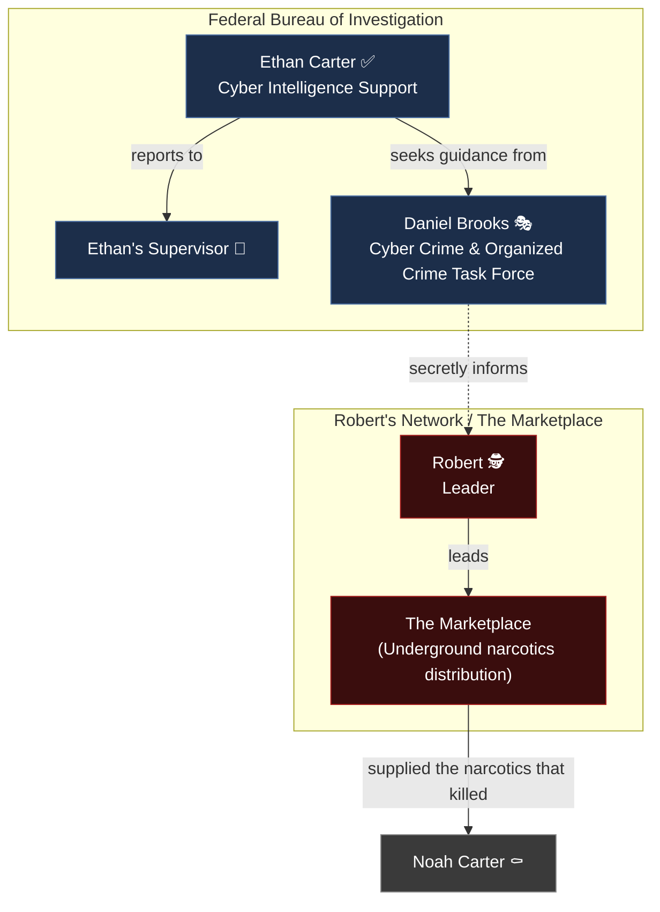

# Organizations — The Silk Road Investigation

> **Document type:** Narrative Design Reference
> **Location:** `docs/story/ORGANIZATIONS.md`
> **Audience:** Developers, narrative writers, game designers, challenge creators
> **Status:** 🟡 Living document — populated from confirmed Prologue material; most structural detail is `TODO`

This document catalogs every faction and organization referenced in the story so far. See [`CHARACTERS.md`](./CHARACTERS.md) for individual profiles and [`WORLD.md`](./WORLD.md) for the full relationship diagram.

---

## Table of Contents

- [Overview Table](#overview-table)
- [Federal Bureau of Investigation (FBI)](#federal-bureau-of-investigation-fbi)
- [The Marketplace](#the-marketplace)
- [Robert's Network](#roberts-network)
- [Organizational Diagram](#organizational-diagram)
- [Changelog](#changelog)

---

## Overview Table

| Organization | Type | Leader / Key Figure | Status | Known Members |
|---|---|---|---|---|
| Federal Bureau of Investigation | Law enforcement (public) | 🧩 TODO (Director not named) | ✅ Active | Ethan Carter, Daniel Brooks, Ethan's Supervisor (unnamed) |
| The Marketplace | Criminal / underground narcotics network | Robert | 🕵️ Officially denied to exist | Robert; compromised assets inside law enforcement (Brooks) |
| Robert's Network | Criminal command structure (overlaps with The Marketplace) | Robert | 🕵️ Hidden / untouchable | 🧩 TODO |

---

## Federal Bureau of Investigation (FBI)

### Overview

The FBI is the public-facing law enforcement organization Ethan Carter belongs to. It is depicted as institutionally confident but, at least in part, compromised — official channels dismiss Ethan's findings as coincidence, and one of its most trusted senior agents is secretly reporting to the very network under investigation.

### Known Divisions

| Division | Associated Character(s) | Notes |
|---|---|---|
| Cyber Intelligence Support | Ethan Carter | Ethan's division; handles organizing intelligence reports, processing digital evidence, and assisting senior investigators. |
| Cyber Crime & Organized Crime Task Force | Daniel Brooks | Brooks' division; a senior, high-trust unit. |

### Institutional Behavior Established So Far

- Requests for archived intelligence file access can be denied on clearance grounds (Ethan's supervisor denies him).
- Investigations that identify cross-case patterns have historically been closed without explanation — establishing a precedent of institutional dismissal or cover-up predating Ethan's involvement.
- At least one senior agent (Brooks) is compromised and actively reports on internal investigations to the target organization.

> 🧩 **TODO** — Overall FBI leadership, field office location, and the full scope of internal compromise (is it only Brooks?) have not been confirmed.

---

## The Marketplace

### Overview

An underground marketplace responsible for distributing highly contaminated synthetic narcotics, including the substance that killed Noah Carter. It is large enough to have affected "thousands of lives" and sophisticated enough to remain officially unacknowledged.

> 🧩 **TODO** — The marketplace does not yet have a confirmed in-fiction name in the provided material (the working title *Silk Road Investigation* refers to the game itself, not a confirmed in-story name for the marketplace — do not assume they are identical without confirmation).

### Known Characteristics

- Distributes synthetic narcotics mixed with dangerous chemicals, sold "without any concern for human life."
- Uses anonymous cryptocurrency transactions and encrypted communications.
- Has a demonstrated capacity to make evidence disappear and witnesses vanish.
- Has influenced or ended investigations across multiple cities without explanation.
- Operates via hidden services on the Tor network (confirmed via Olivia/Ghost's backstory, in which she infiltrated it years before the current investigation).
- Its operations are tracked in real time from a hidden command center: live cryptocurrency transfers, encrypted messages, shipment routes, and dark-web transactions.
- Has expanded significantly over the years between Ghost's initial infiltration and the present investigation.

### Leadership

Led by **Robert** (see [`CHARACTERS.md`](./CHARACTERS.md#robert)), who is, to the public, nonexistent; to governments, a rumor; and to those inside the organization, untouchable.

---

## Robert's Network

### Overview

The operational and enforcement arm surrounding Robert, distinct in function from the marketplace's distribution side, though the two are closely linked (possibly identical — unconfirmed). This is the structure that recruited or blackmailed Daniel Brooks into becoming an internal informant.

### Known Characteristics

- Communicates with compromised assets via secure encrypted phones/terminals.
- Holds documented leverage over at least one senior FBI agent (a record of a past undercover operation's fatal mistake).
- Operates a hidden command center inside an abandoned industrial complex.
- Prefers surveillance and patience over direct confrontation at this stage of the story ("Keep watching him" rather than "deal with him").

> 🧩 **TODO** — Organizational size, hierarchy beneath Robert, funding structure, and relationship (identical vs. separate) to "The Marketplace" have not been confirmed.

---

## Organizational Diagram

---

## Changelog

| Date | Change |
|---|---|
| 🧩 TODO | Initial creation from confirmed Prologue material. |