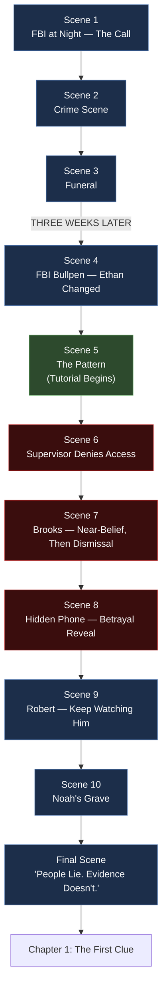

# Prologue — "The Beginning" (Production Breakdown)

> **Document type:** Narrative Design Reference — Scene-Level Production Breakdown
> **Location:** `docs/story/PROLOGUE.md`
> **Audience:** Narrative writers, cutscene/cinematic designers, developers, UI/UX designers, QA
> **Status:** 🟡 Living document — this is the approved revision pass on the Prologue, elevated from condensed narrative prose to an implementable, shot-by-shot sequence
> **Depends on:** [`STORY.md`](./STORY.md), [`CHARACTERS.md`](./CHARACTERS.md), [`TIMELINE.md`](./TIMELINE.md), [`EVIDENCE.md`](./EVIDENCE.md)

---

## Table of Contents

- [Purpose & Scope](#purpose--scope)
- [Relationship to STORY.md](#relationship-to-storymd)
- [Design Goals](#design-goals)
- [Revision Rationale — What Changed & Why](#revision-rationale--what-changed--why)
- [Scene Breakdown](#scene-breakdown)
- [Scene Flow Diagram](#scene-flow-diagram)
- [New / Proposed Canon Additions](#new--proposed-canon-additions)
- [Cross-Reference Table](#cross-reference-table)
- [Tutorial & Gameplay Integration Notes](#tutorial--gameplay-integration-notes)
- [Pacing & Silence Notes](#pacing--silence-notes)
- [Open Conflicts / TODO](#open-conflicts--todo)
- [Changelog](#changelog)

---

## Purpose & Scope

`STORY.md` preserves the Prologue as canonical narrative prose, verbatim, and should not be edited to match this document. This file exists one layer below that: it is the **shot list** — the scene-by-scene breakdown a cinematic/cutscene designer or narrative engineer would actually build from, including revised dialogue, staging direction, and the reasoning behind each change.

This document was produced from a structural review pass on the original Prologue, aimed at making it read like a AAA narrative-investigation opening (show, don't tell) rather than expository setup text.

> [!IMPORTANT]
> Where dialogue in this document differs from the condensed quotes in `STORY.md`, **this document takes precedence for implementation**. It represents the approved revision pass. `STORY.md` should be updated to link here rather than be rewritten — see [Open Conflicts / TODO](#open-conflicts--todo).

---

## Relationship to STORY.md

| | STORY.md | PROLOGUE.md (this document) |
|---|---|---|
| Purpose | Canonical plot record | Production/implementation breakdown |
| Format | Condensed prose, verbatim source quotes | Scene-by-scene beats, staging, revised dialogue |
| Audience | Whole team, high-level reference | Cutscene designers, dialogue/UI engineers |
| Editing policy | Preserve verbatim; do not draft ahead of confirmed material | Living — updated as staging/dialogue is refined |

---

## Design Goals

1. **Show, don't tell.** Dramatize Noah's death and Ethan's transformation cinematically instead of narrating it.
2. **Contrast before collapse.** The player should first see Ethan as an ordinary rookie so the phone call actually lands as a rupture, not a given.
3. **Restraint over spectacle.** Withheld grief reads stronger than an emotional breakdown — no screaming, minimal dialogue at the most painful beats.
4. **Player-driven discovery.** The pattern in the overdose reports should be *found by the player*, not explained to them — this is the seam where the first investigation tutorial lives.
5. **Earn the betrayal.** The audience should almost trust Brooks before the twist. A hard, sudden dismissal doesn't hit as hard as a near-belief followed by betrayal.
6. **Institutional coldness over cruelty.** Authority figures dismissing Ethan should sound procedurally reasonable, not insulting — it's more painful and more realistic for FBI dialogue.

---

## Revision Rationale — What Changed & Why

| Original Beat | Problem | Revision | Why It's Stronger |
|---|---|---|---|
| Supervisor says something like "Your brother was a drug addict." | Reads as gratuitous cruelty; out of character for institutional dialogue | "I'm sorry for your loss, Ethan." *(pause)* "But grief isn't evidence." | Cold professionalism is more dismissive than an insult — and more believable from an FBI supervisor. |
| Brooks dismisses Ethan almost immediately | Betrayal doesn't land because we never trusted Brooks in the first place | Insert a "near-belief" beat: long silence, coffee, Brooks reads the reports before shutting it down | Audience is lured into trusting Brooks exactly like Ethan is — the betrayal (Scene 8) hits both of them at once. |
| Ethan breaks down crying at the grave | Over-plays the emotional beat | Withheld grief; short, clipped lines; a physical action (pocketing the keychain) carries the emotional weight instead of dialogue | "Less is more" — matches Ethan's established personality (introverted, understated, per `CHARACTERS.md`). |
| Pattern discovery is narrated ("Ethan found a pattern") | Passive; tells the player something instead of letting them do it | Player performs the report/metadata matching directly | This becomes the first investigation tutorial rather than a cutscene — reinforces the CTF's core gameplay loop from minute one. |

---

## Scene Breakdown

### Scene 1 — Late Night at the FBI

| Field | Detail |
|---|---|
| Location | FBI Cyber Intelligence bullpen, night |
| POV | Ethan Carter |
| Beat | Ethan alone, still a rookie, processing routine reports. Coffee. Rain against the windows. |
| Turn | Unknown incoming call |
| Key line | *"Your brother has been identified."* |
| Button | Phone falls from his hand. Hard cut to black. |
| Design intent | Establish the "ordinary night" baseline before it's shattered — no narration, no foreshadowing dialogue. |

### Scene 2 — Crime Scene

| Field | Detail |
|---|---|
| Location | Rundown apartment, outskirts of the city (per `WORLD.md`) |
| POV | Ethan, player-controlled walk |
| Beat | Police tape, forensics team working the scene |
| Reveal | Body bag. **Only Noah's hand and keychain are visible — his face is never shown.** |
| Overlay | Official cause-of-death report (`EVID-001`) |
| Design intent | Withholding the face is deliberately *more* emotional than showing it — it personalizes without becoming graphic, and keeps the moment player-interpretive. |

> [!NOTE]
> The keychain introduced here is the same object documented as a recurring habit/prop in `CHARACTERS.md` ("Keeps Noah's old keychain in his pocket"). This scene is its in-fiction origin point.

### Scene 3 — Funeral

| Field | Detail |
|---|---|
| Location | Unconfirmed cemetery (🧩 TODO — see `WORLD.md`) |
| Beat | Rain, sparse attendance, **no dialogue** — only ambient shovel and rain sound design |
| Action | Ethan takes Noah's keychain and keeps it |
| Transition | Text card: **"THREE WEEKS LATER"** |
| Design intent | Silence does the emotional work; dialogue would undercut it. |

### Scene 4 — FBI Bullpen, Three Weeks Later

| Field | Detail |
|---|---|
| Beat | Morning briefing. Other agents are casual, laughing. Ethan says almost nothing — visibly changed. |
| Time skip | Night. The office empties. Ethan stays behind, alone. |
| Transition | **Gameplay tutorial begins here** (see [Tutorial & Gameplay Integration Notes](#tutorial--gameplay-integration-notes)) |
| Design intent | Contrast between the unchanged world and the changed protagonist, without a line of dialogue needed to state it. |

### Scene 5 — The Pattern (First Investigation Tutorial)

| Field | Detail |
|---|---|
| Beat | Player reads case reports, cross-matches wallets and metadata directly — **not narrated** |
| Output | UI/diegetic state change: **"PATTERN DETECTED"** |
| Design intent | This is the mechanical origin of `EVID-003` (Cross-Case Overdose Report Pattern). The player, not Ethan-as-narrator, discovers the connection — this is also the natural boundary between cinematic prologue and interactive tutorial. |

> [!IMPORTANT]
> This scene is the canonical gameplay expression of TIMELINE #7 ("Ethan begins reviewing old overdose reports... uncovers a hidden cross-case pattern"). Challenge creators should treat this as the template for the tutorial-tier difficulty described in `CHALLENGES.md`.

### Scene 6 — The Supervisor

| Field | Detail |
|---|---|
| Beat | Ethan requests archive access; request denied |
| Revised dialogue | *"I'm sorry for your loss, Ethan."* — pause — *"But grief isn't evidence."* |
| Superseded line | ~~"Your brother made bad choices."~~ (rejected — see rationale table above) |
| Design intent | Cold, procedural, not cruel. Consistent with `ORGANIZATIONS.md`'s established FBI institutional behavior ("requests... can be denied on clearance grounds"). |

### Scene 7 — Brooks (Near-Belief Beat)

| Field | Detail |
|---|---|
| Beat | Ethan spreads his reports across Brooks' desk |
| Staging | Long silence. Brooks reads. Drinks coffee. Looks at the wall. Looks back. |
| Key lines | *"I checked every database."* — pause — *"Nothing."* — pause — *"You're chasing ghosts."* |
| Design intent | The audience is meant to *almost* believe Brooks is going to side with Ethan before he shuts it down. This is what makes Scene 8 land as betrayal rather than confirmation of something already suspected. |
| Continuity | Outcome matches `STORY.md`: "Disappointed but trusting his superior, Ethan left the office believing he had reached a dead end." |

### Scene 8 — The Hidden Phone (Betrayal Reveal)

| Field | Detail |
|---|---|
| Beat | Door closes. Hallway empties. Drawer opens. Secure encrypted phone retrieved. |
| Key line | *"He knows."* |
| Cross-ref | `EVID-004` (Secure Encrypted Phone), `TIMELINE.md` #10 |
| Design intent | No revision recommended — this beat already functions as intended. Keep the clipped, minimal call structure ("He knows." / "Who?" / "The new recruit.") as the model for all future Brooks–Robert communication per `CHARACTERS.md` design notes. |

### Scene 9 — Robert / The Man in the Shadows

| Field | Detail |
|---|---|
| Location | Hidden command center, abandoned industrial complex |
| Beat | Dark room, wall of screens, **silhouette only — no face shown** |
| Key line | *"Keep watching him."* |
| Cross-ref | `TIMELINE.md` #10–#11 |
| Design intent | Consistent with `CHARACTERS.md`'s explicit instruction not to generate concept art or physical detail for Robert until confirmed — the silhouette-only staging is the correct visual solution given current canon. |

### Scene 10 — Noah's Grave (Emotional Climax)

| Field | Detail |
|---|---|
| Location | Cemetery, night, rain |
| Beat | Ethan kneels, places flowers |
| Direction | **Restraint.** No breakdown. Withheld grief plays stronger than an outward one. |
| Revised core dialogue | *"You were supposed to become an engineer."* — pause — *"Not another file."* — pause — *"I failed you."* |
| Closing action beat | Ethan starts to leave the keychain on the grave — then changes his mind and pockets it instead. |
| Design intent | The action beat (not a line of dialogue) is what should carry the scene. This is the definitive in-fiction origin for the keychain habit in `CHARACTERS.md`. |

> [!NOTE]
> **Resolved:** The family backstory referenced by the optional extended dialogue pass for this scene (mother, father) is now confirmed canon — see [New / Proposed Canon Additions](#new--proposed-canon-additions). The extended dialogue itself (specific lines referencing "Mom"/"Dad") has not been drafted yet and should still go through the normal revision-pass process before implementation; only the underlying backstory facts are confirmed.

### Final Scene — Thesis Statement

| Field | Detail |
|---|---|
| Beat | Black screen, two-part text card |
| Card 1 | **"People lie."** |
| Beat | ~2 second hold |
| Card 2 | **"Evidence doesn't."** |
| Transition | "PROLOGUE COMPLETE" → "CHAPTER 1: THE FIRST CLUE" |
| Design intent | This is the first in-fiction appearance of Ethan's signature philosophy (`CHARACTERS.md`). It should land here as a thesis statement, not just recur later as a loading-screen motif — the recurrence only works if this is the origin. |

---

## Scene Flow Diagram

---

## New / Proposed Canon Additions

> [!NOTE]
> **Status update (narrative lead, 2026-08-15):** Items #1–#3 below are now **confirmed canon**. `CHARACTERS.md` has been updated accordingly (Ethan = 23, Noah = 17, Mother and Father entries moved from "Proposed (Unconfirmed)" to "Confirmed"). Item #4 (specific grave-scene dialogue lines) has not been drafted and still needs a normal revision pass before implementation. The father/Robert-network foreshadowing question noted under item #2 remains open — see [Open Conflicts / TODO](#open-conflicts--todo).

| # | Addition | Status |
|---|---|---|
| 1 | Mother dies during Noah's birth. | ✅ Confirmed canon. |
| 2 | Father was a "respected FBI agent," killed in an encounter when Ethan was ~17–18 and Noah was ~12. Ethan becomes Noah's guardian while attending the FBI Academy. | ✅ Confirmed canon. 🧩 Still open: does the father's death connect to Robert's network at all, or is it coincidental? Needs explicit confirm/deny from the narrative lead before use in dialogue or challenge design. |
| 3 | Ages: **Ethan 23, Noah 17.** | ✅ Confirmed canon. `CHARACTERS.md` Quick Reference and image-generation prompt updated to match; the prior conflict with "26" is resolved. |
| 4 | Grave-scene dialogue referencing "Mom" and "Dad" directly. | 🧩 Still TODO — contingent facts (#1, #2) are now approved, but the specific dialogue lines have not been drafted. Both parents now have stub entries in `CHARACTERS.md` per this row's original recommendation. |

---

## Cross-Reference Table

| Scene | Story Beat (STORY.md) | Evidence | Character(s) | Timeline # |
|---|---|---|---|---|
| 1 | "A cold, rainy evening..." | — | Ethan Carter | #6 |
| 2 | Noah found dead, official report | EVID-001 | Ethan Carter, Noah Carter | #6 |
| 3 | (implied, not detailed in STORY.md) | — | Ethan Carter, Noah Carter | #6 |
| 4 | "Three Weeks Later" | — | Ethan Carter | #7 |
| 5 | "A Pattern Nobody Saw" | EVID-003 | Ethan Carter | #7 |
| 6 | "The Request" | — | Ethan Carter, Ethan's Supervisor | #8 |
| 7 | "The Senior Agent" | — | Ethan Carter, Daniel Brooks | #9 |
| 8 | "Behind Closed Doors" | EVID-004 | Daniel Brooks, Robert | #10 |
| 9 | "The Man in the Shadows" | — | Robert | #10, #11 |
| 10 | (not present in STORY.md — new material) | — | Ethan Carter, Noah Carter | — |
| Final | Signature quote origin | — | Ethan Carter | — |

---

## Tutorial & Gameplay Integration Notes

- **Scene 5 is the hard boundary** between passive cinematic prologue and interactive gameplay. Recommend this be the first checkpoint/save state created for a player.
- The "PATTERN DETECTED" state should be treated as the template for tutorial-tier challenges — see `CHALLENGES.md`'s Difficulty Guidelines ("Introductory" tier: "should mirror Ethan's own first discoveries — simple pattern-recognition across provided case files").
- Scenes 6–9 are gate-locked cinematics (no player input) bridging the tutorial into Chapter 1 — no challenge content should be placed here; they exist purely to deliver the Brooks/Robert betrayal reveal.
- Scene 10 and the Final Scene are non-interactive by design — this is a deliberate pacing choice to let the emotional beat land before Chapter 1's gameplay resumes.

---

## Pacing & Silence Notes

Several scenes are deliberately dialogue-free or near-silent. This is a repeated structural device, not an accident, and should be preserved during implementation:

- Scene 3 (Funeral) — sound design only, no lines.
- Scene 7 (Brooks) — long pauses are load-bearing; do not compress the silences to save runtime.
- Scene 10 (Grave) — the closing **action** (pocketing the keychain) is the emotional payload, not a line of dialogue. Do not add a closing monologue on top of it.

---

## Open Conflicts / TODO

- ✅ **Age conflict — RESOLVED.** Ethan is confirmed at 23 (Noah at 17). `CHARACTERS.md` updated to match; Scene 1–10 age-sensitive content can now be implemented using 23.
- 🧩 Father's cause of death ("killed in an encounter") is vague — clarify whether line-of-duty, and whether any connection to Robert's network is intended or must be explicitly ruled out to avoid accidental foreshadowing. (Backstory itself is confirmed; this specific sub-question is still open.)
- ✅ Mother's cause of death tied to childbirth — confirmed as intended literally.
- 🧩 `STORY.md` should have its Prologue section updated with a pointer to this document (add to `Related Documents`); the verbatim source prose in `STORY.md` should NOT be overwritten.
- 🧩 Funeral location (Scene 3) is not yet specified in `WORLD.md` — needs a `Known Locations` entry once confirmed.
- 🧩 Grave-scene dialogue referencing "Mom" and "Dad" directly (item #4 above) has not been drafted yet, even though the underlying backstory is now confirmed.

---

## Changelog

| Date | Change |
|---|---|
| 🧩 TODO | Initial creation from the approved Prologue revision/review pass; supersedes ad hoc scene notes. Flags age conflict and unconfirmed family-backstory additions for narrative lead review. |
| 2026-08-15 | Narrative lead resolved the age conflict (Ethan = 23, Noah = 17) and confirmed the proposed family backstory as canon. Updated New / Proposed Canon Additions and Open Conflicts / TODO accordingly; Scene 10's parent-reference warning downgraded to a note. Grave-scene "Mom"/"Dad" dialogue itself remains undrafted. |