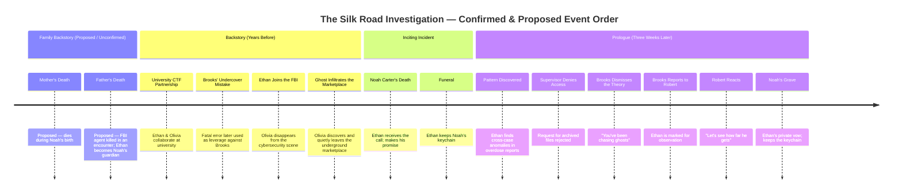

# Timeline — The Silk Road Investigation

> **Document type:** Narrative Design Reference
> **Location:** `docs/story/TIMELINE.md`
> **Audience:** Developers, narrative writers, game designers, QA
> **Status:** 🟡 Living document — exact dates are not yet established; events are ordered relatively based on the confirmed Prologue, character backstories, and the `PROLOGUE.md` production breakdown

> [!NOTE]
> No absolute calendar dates have been provided in the source material. All entries use relative sequencing. Do not assign specific years/dates without confirmation — flag as `TODO` instead.

> [!WARNING]
> Entries #1–#2 below originate from the [`PROLOGUE.md`](./PROLOGUE.md) revision pass and are marked **🧩 Proposed (Unconfirmed)**. They are not yet reconciled with confirmed character ages in `CHARACTERS.md`. Do not treat them as canon until the narrative lead resolves the conflict.

---

## Table of Contents

- [Legend](#legend)
- [Master Timeline](#master-timeline)
- [Timeline Diagram](#timeline-diagram)
- [Changelog](#changelog)

---

## Legend

| Symbol | Meaning |
|---|---|
| 🧩 | Exact timing unconfirmed / TODO |
| ⚰️ | Character death |
| 🎬 | Confirmed on-page scene in the Prologue |
| ⚠️ | Proposed but unconfirmed / conflicts with existing canon |

---

## Master Timeline

| Order | Relative Period | Event | Characters Involved | Source |
|---|---|---|---|---|
| 1 | 🧩⚠️ Proposed — years before the investigation | **Proposed (Unconfirmed):** Mother dies during Noah's birth. | Noah Carter, Mother (unnamed) | `PROLOGUE.md` (proposed) |
| 2 | 🧩⚠️ Proposed — Ethan ~17–18, Noah ~12 | **Proposed (Unconfirmed):** Father, a "respected FBI agent," is killed in an unspecified encounter. Ethan becomes Noah's guardian while attending the FBI Academy. ⚠️ Conflicts with Ethan's confirmed age of 26 in `CHARACTERS.md` if Noah's proposed age of 17 is also used — see `PROLOGUE.md` → Open Conflicts / TODO. | Ethan Carter, Noah Carter, Father (unnamed) | `PROLOGUE.md` (proposed) |
| 3 | 🧩 Years before the investigation | Ethan Carter and Olivia Reed study together at university, competing and collaborating in Capture-the-Flag competitions. Ethan focuses on evidence gathering; Olivia focuses on demonstrating exploits (with permission) against lab machines. | Ethan Carter, Olivia Reed | Character backstory |
| 4 | 🧩 Years before the investigation | Daniel Brooks, during an undercover operation, makes a mistake that costs innocent lives. Someone documents everything; this record later becomes leverage used to compromise him. | Daniel Brooks | Character backstory |
| 5 | 🧩 Some years before the investigation | Ethan graduates university and joins the FBI. Olivia disappears from the visible cybersecurity community. | Ethan Carter, Olivia Reed | Character backstory |
| 6 | 🧩 Several years before the investigation | Olivia (as "Ghost") discovers an emerging, still relatively unknown underground marketplace via Tor hidden services. She infiltrates parts of its infrastructure, copies technical information, and finds an abandoned Bitcoin wallet linked to the operation, transferring a small amount as proof of access before quietly leaving. She considers reporting it, but decides someone else will handle it. | Olivia Reed / Ghost | Character backstory |
| 7 | 🧩 The following months and years | The marketplace expands undisturbed; thousands of lives are affected. | The Marketplace | Character backstory |
| 8 | 🎬 "A cold, rainy evening" | Special Agent Ethan Carter receives the call that his younger brother, Noah Carter, has been found dead of an overdose caused by contaminated synthetic narcotics, in a rundown apartment on the outskirts of the city. Noah becomes one of the marketplace's victims. Standing beside his brother's body, Ethan promises to find those responsible. Staged in full as `PROLOGUE.md` Scenes 1–2. | Ethan Carter, Noah Carter ⚰️ | Prologue / `PROLOGUE.md` Scenes 1–2 |
| 9 | 🎬 Shortly after | Noah's funeral. No dialogue; Ethan takes and keeps Noah's keychain. Staged in `PROLOGUE.md` Scene 3 (not detailed in `STORY.md`'s condensed prose). | Ethan Carter, Noah Carter ⚰️ | `PROLOGUE.md` Scene 3 |
| 10 | 🎬 Three weeks later | Ethan, having recently graduated the FBI Academy, is working as a Junior Special Agent in Cyber Intelligence Support. In his spare time he begins reviewing old overdose reports and uncovers a hidden cross-case pattern: anonymous cryptocurrency transactions, encrypted communications, disappearing evidence, vanished witnesses, and investigations closed without explanation. Staged as `PROLOGUE.md` Scenes 4–5, where the pattern discovery becomes the first interactive investigation tutorial. | Ethan Carter | Prologue / `PROLOGUE.md` Scenes 4–5 |
| 11 | 🎬 Shortly after (same period) | Ethan approaches his supervisor for access to archived intelligence files connecting the cases; the request is denied, and his findings are dismissed as coincidence. `PROLOGUE.md` Scene 6 revises the supervisor's delivery to be coldly professional rather than blunt, without changing the outcome. | Ethan Carter, Ethan's Supervisor | Prologue / `PROLOGUE.md` Scene 6 |
| 12 | 🎬 Shortly after (same period) | Ethan brings his findings to Senior Agent Daniel Brooks, who tells him there is no organization, no marketplace, and no evidence — that he has been "chasing ghosts" — and advises him to forget about it. Ethan leaves believing he has hit a dead end. `PROLOGUE.md` Scene 7 adds a "near-belief" beat where Brooks visibly weighs the evidence before dismissing it. | Ethan Carter, Daniel Brooks | Prologue / `PROLOGUE.md` Scene 7 |
| 13 | 🎬 Immediately after | Once alone, Brooks retrieves a hidden secure encrypted phone and reports Ethan's investigation to Robert. Robert asks whether Ethan can prove anything (not yet) and whether they should "deal with him"; Brooks says no, noting Ethan is inexperienced but asking the right questions. Robert instructs Brooks to keep watching him. | Daniel Brooks, Robert | Prologue / `PROLOGUE.md` Scene 8 |
| 14 | 🎬 Same period, elsewhere | Robert, operating from a hidden command center in an abandoned industrial complex, receives the warning about the new FBI recruit and reacts with amused confidence: "A rookie... Let's see how far he gets." | Robert | Prologue / `PROLOGUE.md` Scene 9 |
| 15 | 🎬 Same night | Ethan visits Noah's grave alone. Restrained, private vow to find those responsible; chooses to keep Noah's keychain rather than leave it behind. Closes on the text card "People lie. Evidence doesn't." This scene is not present in `STORY.md`'s condensed prose and is documented only in `PROLOGUE.md` Scene 10 and Final Scene. | Ethan Carter, Noah Carter ⚰️ | `PROLOGUE.md` Scene 10 / Final Scene |
| 16 | 🧩 TODO | Future chapters — not yet provided. | — | — |

---

## Timeline Diagram

---

## Changelog

| Date | Change |
|---|---|
| 🧩 TODO | Initial creation from confirmed Prologue and character backstory material. |
| 🧩 TODO | Inserted proposed (unconfirmed) family-backstory entries #1–#2 from `PROLOGUE.md`; renumbered subsequent entries; added funeral (#9) and grave-scene (#15) entries sourced from `PROLOGUE.md` with no equivalent in `STORY.md`'s condensed prose; added `PROLOGUE.md` scene cross-references throughout. No previously confirmed entries were altered in substance. |