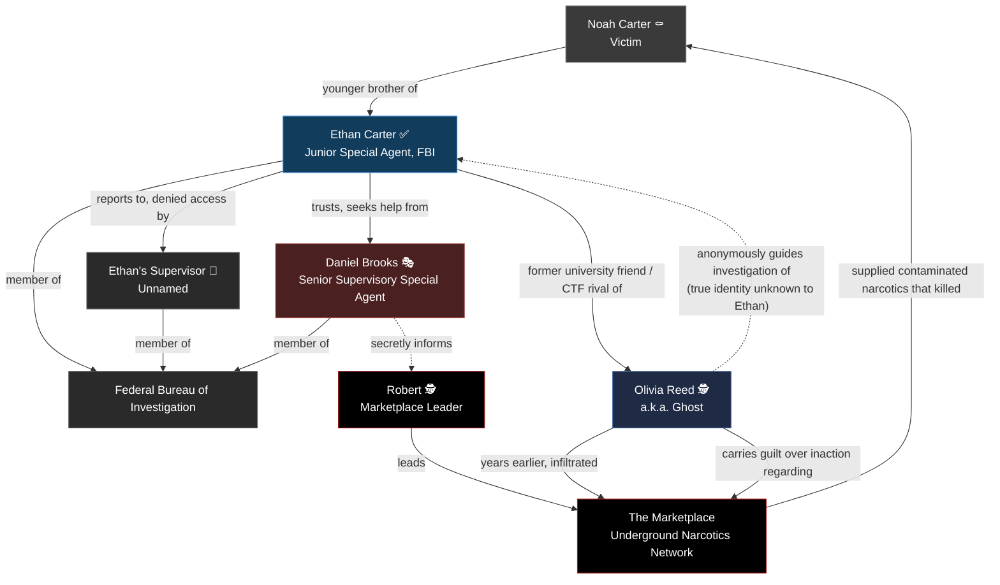
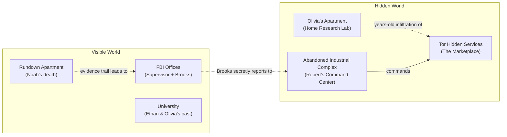

# World — The Silk Road Investigation

> **Document type:** Narrative Design Reference
> **Location:** `docs/story/WORLD.md`
> **Audience:** Developers, narrative writers, game designers, artists, UI/UX designers
> **Status:** 🟡 Living document — world detail is limited to what the Prologue and character backstories confirm; most geographic and institutional detail is `TODO`

This document is the "atlas" of the game world: locations, institutions, tone, and the full relationship map connecting every character and organization introduced so far.

---

## Table of Contents

- [World Snapshot](#world-snapshot)
- [Known Locations](#known-locations)
- [Institutions & Factions](#institutions--factions)
- [Tone & Visual Identity](#tone--visual-identity)
- [Full Relationship Diagram](#full-relationship-diagram)
- [Location Map (Conceptual)](#location-map-conceptual)
- [Changelog](#changelog)

---

## World Snapshot

| Field | Value |
|---|---|
| Time Period | Present day (contemporary setting implied by FBI, cryptocurrency, Tor, encrypted phones) |
| Country / Region | 🧩 TODO — not specified in source material |
| Core Conflict | A rookie FBI agent investigating a hidden global narcotics marketplace vs. an untouchable criminal leader who has compromised the agent's own mentor |
| Central Institutions | Federal Bureau of Investigation; The Marketplace / Robert's Network |
| Central Technology Motifs | Cryptocurrency, encrypted communications, Tor hidden services, digital forensics, OSINT |

---

## Known Locations

| Location | Description | Associated Character(s) | Status |
|---|---|---|---|
| Rundown apartment, outskirts of the city | Where Noah Carter was found dead. | Noah Carter | 🎬 Confirmed |
| FBI office (Ethan's supervisor) | Where Ethan's request for archive access is denied. | Ethan Carter, Ethan's Supervisor | 🎬 Confirmed |
| Daniel Brooks' office | Contains commendations on the walls, a desk with a hidden secure encrypted phone and an old newspaper clipping. Where Brooks tells Ethan to "forget about it," and where Brooks secretly calls Robert. | Ethan Carter, Daniel Brooks | 🎬 Confirmed |
| Abandoned industrial complex (hidden command center) | Robert's base of operations; dozens of monitors track cryptocurrency transfers, encrypted messages, shipment routes, and dark-web transactions. | Robert | 🎬 Confirmed |
| Olivia Reed's apartment | Filled with monitors, notebooks, old hard drives, and whiteboards covered in network diagrams — her home research lab. | Olivia Reed / Ghost | 🎬 Confirmed (character profile) |
| University (unnamed) | Where Ethan and Olivia met and competed in CTF competitions. | Ethan Carter, Olivia Reed | 🎬 Confirmed (character backstory) |

> 🧩 **TODO** — No city, state, or country has been specified for any location. Do not assign a real-world city without confirmation.

---

## Institutions & Factions

See [`ORGANIZATIONS.md`](./ORGANIZATIONS.md) for full detail. Summary:

- **Federal Bureau of Investigation** — public law enforcement institution; internally compromised at at least one senior level.
- **The Marketplace** — hidden global narcotics distribution network; officially denied to exist.
- **Robert's Network** — the command/leverage structure behind The Marketplace, capable of compromising federal agents.

---

## Tone & Visual Identity

| Element | Direction |
|---|---|
| Overall Mood | Quiet procedural tension; grief-driven persistence; institutional menace rather than overt violence |
| Color Language | Cold blues/greys for FBI and hacking spaces; warm neutral tones for outwardly "trustworthy" institutional spaces (e.g., Brooks' office) masking hidden corruption; near-black/red accents reserved for Robert's hidden command center |
| Sound Design Direction | 🧩 TODO |
| UI Motifs | Whiteboard/corkboard with red string (Ethan's investigation style); terminal/monitor walls (Robert's command center); notebook and case-file aesthetics |

---

## Full Relationship Diagram

---

## Location Map (Conceptual)

---

## Changelog

| Date | Change |
|---|---|
| 🧩 TODO | Initial creation from confirmed Prologue and character backstory material. |